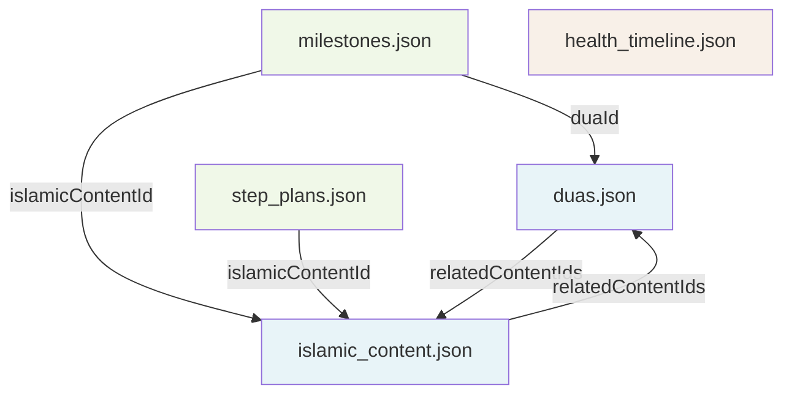

# Design Document: Data Content Enrichment

## Overview

এই feature-টি সম্পূর্ণ **data-only enrichment** — কোনো নতুন UI component, screen বা service তৈরি হবে না। লক্ষ্য হলো `assets/data` ফোল্ডারের পাঁচটি JSON ফাইলকে সমৃদ্ধ করা এবং `types/index.ts`-এ নতুন optional fields যোগ করা।

### মূল নীতি

- **Backward Compatible**: সব নতুন field `optional` (`?`) — বিদ্যমান TypeScript code ও ContentService কোনো পরিবর্তন ছাড়াই কাজ করবে।
- **Data-Only**: JSON ফাইলগুলো সরাসরি edit করা হবে — কোনো migration script বা runtime transformation নেই।
- **Cross-linking**: ফাইলগুলোর মধ্যে পারস্পরিক reference সম্পূর্ণ ও সঠিক রাখা হবে।
- **Content Quality**: সব ইসলামিক content প্রামাণিক, সহজ বাংলায় এবং ধূমপান ত্যাগের প্রসঙ্গে প্রাসঙ্গিক।

---

## Architecture

### ফাইলগুলোর মধ্যে সম্পর্ক



### Cross-linking Strategy

```
duas.json ←→ islamic_content.json    (topic-based bidirectional linking)
step_plans.json → islamic_content.json  (islamicContentId — বিদ্যমান)
milestones.json → islamic_content.json  (islamicContentId — বিদ্যমান)
milestones.json → duas.json             (duaId — নতুন)
```

### পরিবর্তনের সারসংক্ষেপ

| ফাইল | পরিবর্তনের ধরন | পরিমাণ |
|------|---------------|--------|
| `duas.json` | relatedContentIds পূরণ, stepAssignment যোগ, ১৮টি নতুন entry | +১৮ entries |
| `health_timeline.json` | ৬টি নতুন entry, ৩টি নতুন field প্রতিটিতে | +৬ entries |
| `step_plans.json` | ৬টি নতুন field প্রতিটি step-এ, tips ৩→৫ | ৪১ steps আপডেট |
| `milestones.json` | ৩-৪টি নতুন field প্রতিটিতে | ৭ entries আপডেট |
| `islamic_content.json` | খালি relatedContentIds পূরণ | ৪১ entries আপডেট |
| `types/index.ts` | নতুন optional fields | interface আপডেট |

---

## Components and Interfaces

### TypeScript Interface Updates (`types/index.ts`)

বিদ্যমান interfaces-এ নিচের optional fields যোগ করতে হবে:

#### `IslamicContent` interface (duas.json-এর জন্য)
```typescript
export interface IslamicContent {
  // ... বিদ্যমান fields অপরিবর্তিত ...
  practicalPhrase?: string;  // শুধু social_pressure_dua category-তে
}
```

#### `HealthTimelineEntry` interface
```typescript
export interface HealthTimelineEntry {
  // ... বিদ্যমান fields অপরিবর্তিত ...
  islamicNote?: string;      // ইসলামিক দৃষ্টিভঙ্গি (১-২ বাক্য)
  withdrawalNote?: string;   // সহজ বাংলায় withdrawal symptoms
  encouragement?: string;    // উৎসাহমূলক বাক্য
}
```

#### `StepPlan` interface
```typescript
export interface StepPlan {
  // ... বিদ্যমান fields অপরিবর্তিত ...
  islamicInsight?: string;
  reflection_prompt?: string;
  hadith?: {
    arabicText: string;
    banglaTranslation: string;
    source: string;
  };
  familyMotivation?: string;
  moneySavedContext?: string;
  ramadanTip?: string;  // শুধু ধাপ ১–৭
}
```

#### `Milestone` interface
```typescript
export interface Milestone {
  // ... বিদ্যমান fields অপরিবর্তিত ...
  duaId?: string;
  nextMilestoneMotivation?: string;
  achievementBadge?: string;
  completionMessage?: string;  // শুধু ধাপ ৪১
}
```

### `DuaCategory` enum আপডেট (`types/enums.ts`)

```typescript
export type DuaCategory =
  | 'morning_adhkar'
  | 'evening_adhkar'
  | 'craving_dua'
  | 'tawbah_dua'
  | 'shukr_dua'
  | 'milestone_dua'      // নতুন
  | 'slip_up_dua'        // নতুন
  | 'social_pressure_dua' // নতুন
  | 'family_dua'         // নতুন
  | 'night_craving_dua'  // নতুন
  | 'ramadan_dua';       // নতুন
```

---

## Data Models

### duas.json — নতুন Fields ও Entries

#### নতুন optional field
```json
{
  "practicalPhrase": "ভাই, আমি এখন ছাড়ার চেষ্টা করছি — একটু সাহায্য করুন"
}
```
এই field শুধুমাত্র `social_pressure_dua` category-র entries-এ থাকবে।

#### stepAssignment Mapping Table

| duaCategory | stepAssignment | কারণ |
|-------------|---------------|------|
| `craving_dua` | ১–৭ | প্রথম সপ্তাহে craving সবচেয়ে তীব্র |
| `social_pressure_dua` | ১–৭ | সামাজিক চাপ প্রথম সপ্তাহে বেশি |
| `night_craving_dua` | ১–১৪ | প্রথম দুই সপ্তাহে রাতের craving বেশি |
| `tawbah_dua` | ৩১–৪১ | তাওবা/ইস্তেকামাত পর্যায় |
| `shukr_dua` | ২২–৩০ | শুকর পর্যায় |
| `morning_adhkar` | null | সব ধাপে প্রযোজ্য |
| `evening_adhkar` | null | সব ধাপে প্রযোজ্য |
| `family_dua` | null | সব ধাপে প্রযোজ্য |
| `ramadan_dua` | null | রমজানে যেকোনো ধাপে |
| `milestone_dua` | null | milestone-এ |
| `slip_up_dua` | null | slip-up-এ |

#### নতুন Entries Count

| ID Range | Category | সংখ্যা |
|----------|----------|--------|
| dua_018 – dua_020 | `milestone_dua` | ৩টি |
| dua_021 – dua_023 | `slip_up_dua` | ৩টি |
| dua_024 – dua_025 | `craving_dua` (additional) | ২টি |
| dua_026 – dua_028 | `social_pressure_dua` | ৩টি |
| dua_029 – dua_031 | `family_dua` | ৩টি |
| dua_032 – dua_033 | `night_craving_dua` | ২টি |
| dua_034 – dua_035 | `ramadan_dua` | ২টি |
| **মোট** | | **১৮টি** |

#### relatedContentIds Linking Strategy

Topic-based mapping:
- `tawakkul` topic → `ic_001`, `ic_002`, `ic_003`, `ic_004`, `ic_005` থেকে ২টি
- `self_control` topic → `ic_006`–`ic_014` range থেকে ২টি
- `tawbah` topic → `ic_030`–`ic_041` range থেকে ২টি
- `health` topic → `ic_022`–`ic_029` range থেকে ২টি

### health_timeline.json — নতুন Entries ও Fields

#### নতুন Fields Schema
```json
{
  "timeLabel": "৩ দিন",
  "timeMinutes": 4320,
  "benefit": "...",
  "icon": "💨",
  "islamicNote": "আল্লাহ বলেন: 'তোমাদের শরীর তোমাদের উপর আমানত।' এই পরিবর্তন সেই আমানত রক্ষার প্রমাণ।",
  "withdrawalNote": "এই সময়ে মাথাব্যথা বা রাগ হওয়া স্বাভাবিক — এটি শরীর সুস্থ হওয়ার লক্ষণ।",
  "encouragement": "তিন দিন পার করেছেন — সবচেয়ে কঠিন সময় প্রায় শেষ!"
}
```

#### নতুন Entries

| timeLabel | timeMinutes | বিদ্যমান? |
|-----------|-------------|----------|
| ৩ দিন | 4320 | হ্যাঁ (৭২ ঘণ্টা হিসেবে) — নতুন fields যোগ হবে |
| ৫ দিন | 7200 | না — নতুন entry |
| ৬ মাস | 259200 | না — নতুন entry |
| ৫ বছর | 2628000 | না — নতুন entry |
| ১০ বছর | 5256000 | না — নতুন entry |
| ১৫ বছর | 7884000 | না — নতুন entry |

> **নোট**: বিদ্যমান ১০টি entry-তেও `islamicNote`, `withdrawalNote`, `encouragement` fields যোগ করতে হবে।

#### Ascending Order নিশ্চিতকরণ

সব entries `timeMinutes` অনুযায়ী sort করা থাকবে:
`20 → 480 → 1440 → 2880 → 4320 → 7200 → 10080 → 20160 → 43200 → 129600 → 259200 → 525600 → 2628000 → 5256000 → 7884000`

### step_plans.json — নতুন Fields

#### প্রতিটি Step-এ যোগ হবে
```json
{
  "islamicInsight": "তাওয়াক্কুল মানে শুধু আল্লাহর উপর ছেড়ে দেওয়া নয়...",
  "reflection_prompt": "আজ কোন মুহূর্তে আপনি সবচেয়ে বেশি আল্লাহর সাহায্য অনুভব করেছেন?",
  "hadith": {
    "arabicText": "احْرِصْ عَلَى مَا يَنْفَعُكَ...",
    "banglaTranslation": "যা তোমার উপকার করে তার প্রতি আগ্রহী হও...",
    "source": "সহিহ মুসলিম, হাদিস ২৬৬৪"
  },
  "familyMotivation": "আজ সন্তানকে বলুন আপনি তার জন্য ধূমপান ছাড়ছেন।",
  "moneySavedContext": "আজ পর্যন্ত বাঁচানো টাকায় সন্তানের একটি বই কিনতে পারতেন।"
}
```

#### `ramadanTip` — শুধু ধাপ ১–৭
```json
{
  "ramadanTip": "রমজানে রোজা রাখলে দিনে ধূমপান করা যায় না — এটি ধূমপান ত্যাগের সবচেয়ে বড় সুযোগ। রোজার ইচ্ছাশক্তিকে কাজে লাগান।"
}
```

#### Theme-ভিত্তিক `islamicInsight` গাইডলাইন

| ধাপ | Theme | islamicInsight-এর বিষয় |
|-----|-------|------------------------|
| ১–৭ | তাওয়াক্কুল | তাওয়াক্কুলের ধারণা ও ধূমপান ত্যাগের সাথে সম্পর্ক |
| ৮–১৪ | সবর | সবরের ফজিলত ও নিকোটিন withdrawal-এর সাথে সম্পর্ক |
| ১৫–২১ | নিয়ত | নিয়তের গুরুত্ব ও অভ্যাস পরিবর্তনের সাথে সম্পর্ক |
| ২২–৩০ | শুকর | শুকরের ধারণা ও স্বাস্থ্য পুনরুদ্ধারের সাথে সম্পর্ক |
| ৩১–৪১ | তাওবা/ইস্তেকামাত | তাওবা ও দীর্ঘমেয়াদী পরিবর্তনের সাথে সম্পর্ক |

### milestones.json — নতুন Fields

```json
{
  "duaId": "dua_018",
  "nextMilestoneMotivation": "আর মাত্র ৪ দিন — ৭ দিনের মাইলস্টোন আপনার অপেক্ষায়!",
  "achievementBadge": "🌟",
  "completionMessage": null
}
```

`completionMessage` শুধু ৪১তম milestone-এ থাকবে:
```json
{
  "completionMessage": "আলহামদুলিল্লাহ! আপনি ৪১ দিনের পূর্ণ যাত্রা সম্পন্ন করেছেন। এটি শুধু ধূমপান ত্যাগ নয় — এটি একটি জিহাদুন নাফস। আল্লাহ আপনার এই সংগ্রামকে কবুল করুন।"
}
```

#### Milestone Badge Mapping

| steps | achievementBadge |
|-------|-----------------|
| 1 | 🌱 |
| 3 | 💪 |
| 7 | ⭐ |
| 14 | 🌟 |
| 21 | 🏆 |
| 30 | 🎖️ |
| 41 | 👑 |

---

## Correctness Properties

*A property is a characteristic or behavior that should hold true across all valid executions of a system — essentially, a formal statement about what the system should do. Properties serve as the bridge between human-readable specifications and machine-verifiable correctness guarantees.*

এই feature-টি pure data (JSON files) এবং TypeScript type definitions নিয়ে কাজ করে। Property-based testing এখানে প্রযোজ্য কারণ:
- JSON data-র structural invariants আছে যা সব entries-এর জন্য প্রযোজ্য
- Cross-reference validity সব entries-এর জন্য একই নিয়মে পরীক্ষা করা যায়
- Input variation (বিভিন্ন entries) edge cases reveal করতে পারে

### Property 1: duas.json Cross-linking Validity

*For any* dua entry with non-empty `relatedContentIds`, every ID in that array must exist in `islamic_content.json`. No dua should reference a non-existent content ID.

**Validates: Requirements 1.6, 8.3**

### Property 2: stepAssignment Range Validity

*For any* dua entry with non-null `stepAssignment`, the value must be an integer between 1 and 41 inclusive.

**Validates: Requirements 2.5**

### Property 3: health_timeline Ascending Order

*For any* two consecutive entries in `health_timeline.json`, the first entry's `timeMinutes` must be strictly less than the second entry's `timeMinutes`. (Strict inequality also ensures no duplicate timeMinutes values.)

**Validates: Requirements 4.8, 4.9, 8.7**

### Property 4: step_plans islamicContentId Validity

*For any* step plan entry, its `islamicContentId` must exist in `islamic_content.json`.

**Validates: Requirements 8.1**

### Property 5: milestones duaId Validity

*For any* milestone entry with non-null `duaId`, that ID must exist in `duas.json` and its `duaCategory` must be `milestone_dua`.

**Validates: Requirements 7.1**

### Property 6: Unique IDs within each file

*For any* JSON file (`duas.json`, `islamic_content.json`, `step_plans.json`, `milestones.json`), all `id` fields must be unique within that file — no two entries may share the same ID.

**Validates: Requirements 8.5**

### Property 7: social_pressure_dua practicalPhrase presence

*For any* dua entry with `duaCategory === 'social_pressure_dua'`, the `practicalPhrase` field must be present and non-empty (not null, not undefined, not whitespace-only).

**Validates: Requirements 3.9, 10.9, 11.6**

### Property 8: No self-referencing in relatedContentIds

*For any* content entry in `islamic_content.json`, its own `id` must not appear in its `relatedContentIds` array.

**Validates: Requirements 6.3**

---

## Error Handling

এই feature-টি data enrichment — runtime error handling নেই। তবে নিচের scenarios-এ data integrity নিশ্চিত করতে হবে:

### Broken Cross-references
- **Scenario**: কোনো `relatedContentIds` বা `islamicContentId`-এ non-existent ID থাকলে
- **Resolution**: Property tests দিয়ে build-time-এ detect করা হবে। সঠিক valid ID দিয়ে প্রতিস্থাপন করতে হবে।

### Duplicate timeMinutes
- **Scenario**: `health_timeline.json`-এ দুটি entry-র `timeMinutes` একই হলে
- **Resolution**: Property 3 (ascending order) এটি detect করবে। Duplicate entry যোগ করা যাবে না।

### Duplicate IDs
- **Scenario**: কোনো JSON ফাইলে duplicate `id` থাকলে
- **Resolution**: Property 6 (unique IDs) এটি detect করবে।

### TypeScript Compilation Failure
- **Scenario**: নতুন fields TypeScript interface-এর সাথে incompatible হলে
- **Resolution**: `npx tsc --noEmit` দিয়ে verify করতে হবে। সব নতুন field `optional` (`?`) হওয়ায় backward compatibility নিশ্চিত।

---

## Testing Strategy

### Dual Testing Approach

এই feature-এ দুই ধরনের test থাকবে:

1. **Property-based tests** — JSON data-র structural invariants verify করবে
2. **Unit tests** — নির্দিষ্ট examples ও edge cases verify করবে

### Property-Based Testing

**Library**: `fast-check` (বিদ্যমান project-এ ইতিমধ্যে ব্যবহৃত)

**Test File**: `smoke-free-path/__tests__/property/dataIntegrity.property.test.ts`

**Configuration**: প্রতিটি property test minimum 100 iterations চালাবে।

প্রতিটি property test-এ comment tag থাকবে:
```typescript
// Feature: data-content-enrichment, Property 1: duas.json cross-linking validity
```

#### Property Test Implementations

**Property 1 — Cross-linking Validity**:
```typescript
// fast-check দিয়ে duas array থেকে random entry নিয়ে
// প্রতিটি relatedContentId islamic_content.json-এ আছে কিনা check করবে
fc.assert(fc.property(
  fc.constantFrom(...duas),
  (dua) => dua.relatedContentIds.every(id => islamicContentIds.has(id))
));
```

**Property 3 — Ascending Order**:
```typescript
// Consecutive pairs check
for (let i = 0; i < healthTimeline.length - 1; i++) {
  expect(healthTimeline[i].timeMinutes).toBeLessThan(healthTimeline[i+1].timeMinutes);
}
```

**Property 6 — Unique IDs**:
```typescript
// প্রতিটি ফাইলের জন্য
const ids = duas.map(d => d.id);
expect(new Set(ids).size).toBe(ids.length);
```

### Unit Tests

**Test File**: `smoke-free-path/__tests__/unit/dataEnrichment.test.ts`

নিচের specific scenarios cover করবে:
- `social_pressure_dua` category-র entries-এ `practicalPhrase` আছে কিনা
- `milestone_dua` category-র entries `milestones.json`-এর `duaId`-এ referenced কিনা
- ধাপ ১–৭-এ `ramadanTip` আছে কিনা
- ধাপ ৮+ এ `ramadanTip` নেই কিনা
- ৪১তম milestone-এ `completionMessage` আছে কিনা

### TypeScript Compilation Check

```bash
cd smoke-free-path && npx tsc --noEmit
```

এটি নিশ্চিত করবে যে:
- নতুন optional fields TypeScript-এ সঠিকভাবে define করা হয়েছে
- বিদ্যমান code কোনো breaking change ছাড়াই compile হচ্ছে

### Content Quality Review (Manual)

Automated testing-এর বাইরে নিচের বিষয়গুলো manually review করতে হবে:
- সব আরবি টেক্সট সঠিক হরকত সহ
- সব হাদিসের source verified
- `islamicInsight` ও `reflection_prompt` সহজ বাংলায়
- `withdrawalNote`-এ কোনো medical terminology নেই
- `familyMotivation`-এ সন্তান/স্ত্রী/পরিবারের উল্লেখ আছে
