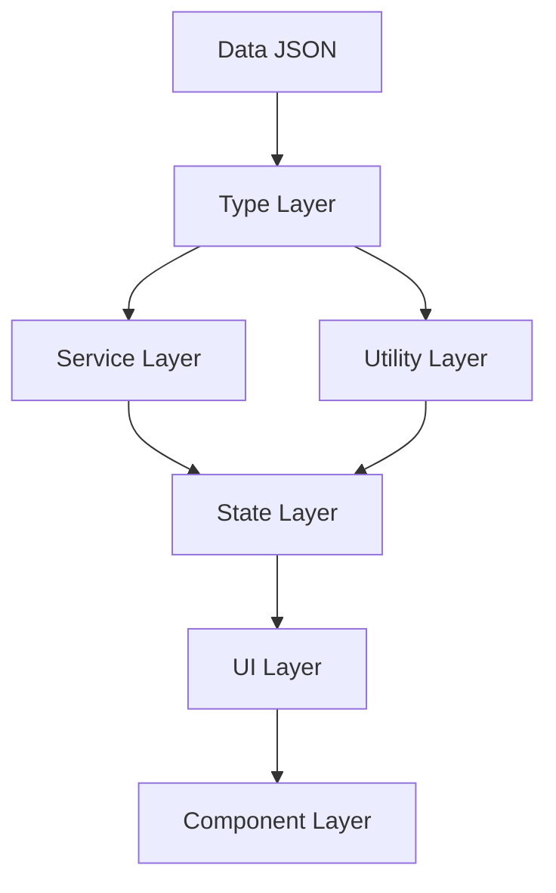

# Design Document: Smoke-Free Path — Calendar থেকে Step-Based মডেলে রূপান্তর

## Overview

"ধোঁয়া-মুক্ত পথ" অ্যাপটি বর্তমানে **calendar-based** মডেলে কাজ করে — `quitDate` সেট করলে সময়ের সাথে স্বয়ংক্রিয়ভাবে দিন এগিয়ে যায়। এই design document-এ অ্যাপটিকে **step-based** মডেলে রূপান্তরের সম্পূর্ণ technical design বর্ণনা করা হয়েছে।

### মূল পরিবর্তন

| বিষয় | আগে (Calendar-based) | পরে (Step-based) |
|-------|---------------------|-----------------|
| অগ্রগতি নির্ধারণ | `quitDate` থেকে auto-calculate | ব্যবহারকারী নিজে step complete করে |
| ধাপ unlock | সময় পার হলে স্বয়ংক্রিয় | আগের ধাপ সম্পূর্ণ করলে |
| ধাপ skip | সম্ভব (দিন হারিয়ে যায়) | অসম্ভব |
| Reset | শুধু `quitDate` পরিবর্তন | সম্পূর্ণ progress clear |
| Checklist | One-way (শুধু check) | Two-way (check/uncheck) |


## Architecture

অ্যাপটির আর্কিটেকচার ৭টি layer-এ বিভক্ত:

```
┌─────────────────────────────────────────────────────────────┐
│                       Data Layer                             │
│  assets/data/daily_plans.json  → "day" key → "step" key     │
│  assets/data/milestones.json   → step-based reinterpret     │
│  assets/data/islamic_content.json (অপরিবর্তিত)              │
│  assets/data/health_timeline.json (অপরিবর্তিত)              │
└───────────────┬─────────────────────────────────────────────┘
                │
┌───────────────▼─────────────────────────────────────────────┐
│                      Type Layer                              │
│  types/index.ts  → StepPlan, StepProgress, PlanState        │
│  types/enums.ts  → StepStatus, SlipUpDecision update        │
└───────────────┬─────────────────────────────────────────────┘
                │
┌───────────────▼─────────────────────────────────────────────┐
│                    Service Layer                             │
│  services/ContentService.ts  → getStepPlan(), getStepContent()│
│  services/StorageService.ts  → AppState shape update        │
│  services/NotificationService.ts → step-based messages      │
└───────────────┬─────────────────────────────────────────────┘
                │
┌───────────────▼─────────────────────────────────────────────┐
│                    Utility Layer                             │
│  utils/trackerUtils.ts                                       │
│    ├─ computeTrackerDay() → সরানো হবে                       │
│    ├─ isStepAccessible(step, planState)                      │
│    ├─ getStepStatus(step, planState, stepProgress)           │
│    ├─ computeProgressStats(profile, planState)               │
│    ├─ detectMilestone(completedSteps, achieved)              │
│    └─ getPhaseMessage(step)                                  │
└───────────────┬─────────────────────────────────────────────┘
                │
┌───────────────▼─────────────────────────────────────────────┐
│                    State Layer                               │
│  context/AppContext.tsx                                      │
│    ├─ PlanState (নতুন)                                       │
│    ├─ stepProgress (dailyProgress → rename)                  │
│    ├─ ACTIVATE_PLAN, RESET_PLAN, COMPLETE_STEP (নতুন)        │
│    ├─ TOGGLE_CHECKLIST_ITEM (two-way, COMPLETE_CHECKLIST_ITEM replace)│
│    └─ HYDRATE (migration logic সহ)                          │
└───────────────┬─────────────────────────────────────────────┘
                │
┌───────────────▼─────────────────────────────────────────────┐
│                     UI Layer                                 │
│  app/(onboarding)/quit-date.tsx → Plan Activation screen    │
│  app/(tabs)/index.tsx           → planState.currentStep     │
│  app/(tabs)/tracker.tsx         → step grid, step unlock    │
│  app/tracker/[step].tsx         → step detail, complete btn │
│  app/(tabs)/progress.tsx        → step-based stats          │
│  app/(tabs)/settings.tsx        → plan reset button         │
│  app/slip-up/index.tsx          → reset_plan option         │
│  app/(tabs)/_layout.tsx         → MilestoneDetector update  │
└───────────────┬─────────────────────────────────────────────┘
                │
┌───────────────▼─────────────────────────────────────────────┐
│                  Component Layer                             │
│  components/DayCard.tsx → StepCard (props update)           │
│  components/ChecklistItem.tsx → two-way toggle              │
└─────────────────────────────────────────────────────────────┘
```

### Dependency Flow




## Components and Interfaces

### Type Layer Design

#### `types/enums.ts` পরিবর্তন

```typescript
// আগে:
export type DayStatus = 'complete' | 'incomplete' | 'future';
export type SlipUpDecision = 'continue' | 'reset_quit_date';

// পরে:
export type StepStatus = 'complete' | 'incomplete' | 'future';  // rename
export type SlipUpDecision = 'continue' | 'reset_plan';          // value change

// নতুন:
export type PlanStatus = 'inactive' | 'active' | 'completed';
```

#### `types/index.ts` পরিবর্তন

```typescript
// ─── নতুন PlanState Interface ─────────────────────────────────
export interface PlanState {
  isActive: boolean;              // প্ল্যান activate হয়েছে কিনা
  activatedAt: string | null;     // ISO datetime — কখন activate হয়েছে
  currentStep: number;            // বর্তমান ধাপ (1-41), 0 = না শুরু
  completedSteps: number[];       // সম্পূর্ণ হওয়া ধাপের তালিকা
  lastCompletedAt: string | null; // সর্বশেষ ধাপ সম্পূর্ণ করার সময়
  totalResets: number;            // কতবার reset হয়েছে
}

// ─── StepPlan (DailyPlan → rename + day → step) ───────────────
export interface StepPlan {
  step: number;                   // 1–41 (আগে: day)
  title: string;
  theme: string;
  affirmation: string;
  checklistItems: ChecklistItem[];
  islamicContentId: string;
  tips: string[];
}

// ─── StepProgress (DailyPlanProgress → rename) ────────────────
export interface StepProgress {
  step: number;                   // (আগে: day)
  completedItems: string[];
  isComplete: boolean;
  completedAt: string | null;
  startedAt: string | null;       // 🆕 কখন এই ধাপ শুরু হয়েছে
  // date field সরানো হয়েছে
}

// ─── UserProfile পরিবর্তন ─────────────────────────────────────
export interface UserProfile {
  id: string;
  name: string;
  cigarettesPerDay: number;
  smokingYears: number;
  // quitDate: string;            // ❌ সরানো হয়েছে
  cigarettePricePerPack: number;
  cigarettesPerPack: number;
  notificationsEnabled: boolean;
  morningNotificationTime: string;
  eveningNotificationTime: string;
  onboardingCompleted: boolean;
  createdAt: string;
}

// ─── AppState পরিবর্তন ────────────────────────────────────────
export interface AppState {
  userProfile: UserProfile | null;
  planState: PlanState;                              // 🆕
  stepProgress: Record<number, StepProgress>;        // 🔄 dailyProgress → stepProgress
  triggerLogs: TriggerLog[];
  cravingSessions: CravingSession[];
  slipUps: SlipUp[];
  bookmarks: string[];
  milestones: Record<number, string>;
  lastOpenedAt: string;
}

// ─── SlipUp পরিবর্তন ──────────────────────────────────────────
export interface SlipUp {
  id: string;
  reportedAt: string;
  triggerId: string | null;
  decision: SlipUpDecision;       // 'continue' | 'reset_plan'
  trackerStep: number;            // 🔄 trackerDay → trackerStep
}
```


### Service Layer Design

#### `services/ContentService.ts` পরিবর্তন

```typescript
// আগে:
export function getDailyPlan(day: number): DailyPlan | null
export function getDailyContent(day: number): IslamicContent | null

// পরে:
export function getStepPlan(step: number): StepPlan | null {
  return stepPlans.find((p) => p.step === step) ?? null;
}

export function getStepContent(step: number): IslamicContent | null {
  return islamicContent.find((c) => c.dayAssignment === step) ?? null;
}
```

**Design Decision**: `dayAssignment` field-এর নাম `IslamicContent`-এ পরিবর্তন না করে শুধু function rename করা হবে — এতে JSON data কম পরিবর্তন হবে।

#### `services/NotificationService.ts` পরিবর্তন

```typescript
// আগে:
export async function scheduleEveningNotification(smokeFreeDay: number, time: string)
// body: `আপনি ${smokeFreeDay} দিন ধূমপান-মুক্ত আছেন`

// পরে:
export async function scheduleEveningNotification(
  smokeFreeDay: number,
  completedSteps: number,
  time: string = '21:00',
): Promise<void>
// body: `আলহামদুলিল্লাহ! আপনি ${smokeFreeDay} দিন ধূমপান-মুক্ত এবং ${completedSteps}টি ধাপ সম্পূর্ণ করেছেন।`

// আগে:
export async function scheduleMilestoneNotification(milestoneDay: number, titleBangla: string)
// body: `${milestoneDay} দিন ধূমপান-মুক্ত`

// পরে:
export async function scheduleMilestoneNotification(
  milestoneStep: number,
  titleBangla: string,
): Promise<void>
// body: `মাশাআল্লাহ! আপনি ${milestoneStep}তম ধাপ সম্পূর্ণ করেছেন!`
```

### Component Design

#### `components/DayCard.tsx` → `components/StepCard.tsx`

```typescript
// আগে:
interface DayCardProps {
  day: number;
  status: DayStatus;
  onPress: () => void;
}

// পরে:
interface StepCardProps {
  step: number;           // day → step
  status: StepStatus;     // DayStatus → StepStatus
  onPress: () => void;
}
```

**Design Decision**: ফাইলটি rename করা হবে `StepCard.tsx`। পুরনো `DayCard.tsx` import করা সব জায়গায় update করতে হবে।

#### `components/ChecklistItem.tsx` — Two-way Toggle

বর্তমান implementation one-way (শুধু check করা যায়)। নতুন implementation:

```typescript
// পরিবর্তন নেই — props একই থাকবে
// কিন্তু parent component-এ TOGGLE_CHECKLIST_ITEM dispatch করতে হবে
// যা add/remove উভয়ই করতে পারে

// Visual feedback যোগ করা হবে:
// - Checked: সবুজ checkbox + strikethrough text
// - Unchecked: empty checkbox + normal text (আগের মতো ফিরে যাবে)
```


## Data Models

### Data Layer Design

#### `assets/data/daily_plans.json` পরিবর্তন

প্রতিটি entry-তে `"day"` key → `"step"` key rename করতে হবে:

```json
// আগে:
{ "day": 1, "title": "...", "theme": "...", ... }

// পরে:
{ "step": 1, "title": "...", "theme": "...", ... }
```

**বিশেষ নোট**: Content text-এ "৪১ দিন" বা "দিন X" reference যেখানে ধাপ concept বোঝানো হয়েছে সেখানে "৪১ ধাপ" বা "ধাপ X" করতে হবে। তবে "আজকের দিনে" বা "প্রতিদিন" এর মতো সাধারণ বাংলা ব্যবহার অপরিবর্তিত থাকবে।

#### `assets/data/milestones.json` পরিবর্তন

Milestone `days` field step হিসেবে reinterpret করা হবে। Title update:

```json
// আগে:
{ "days": 7, "titleBangla": "৭ দিন ধূমপান-মুক্ত", ... }

// পরে:
{ "days": 7, "titleBangla": "৭ম ধাপ সম্পূর্ণ", ... }
```

**Design Decision**: `days` field-এর নাম পরিবর্তন না করে শুধু content update করা হবে — এতে `getMilestoneContent(days)` function-এর signature অপরিবর্তিত থাকবে।

### State Management Design

#### Initial State

```typescript
export const INITIAL_PLAN_STATE: PlanState = {
  isActive: false,
  activatedAt: null,
  currentStep: 0,
  completedSteps: [],
  lastCompletedAt: null,
  totalResets: 0,
};

export const INITIAL_APP_STATE: AppState = {
  userProfile: null,
  planState: INITIAL_PLAN_STATE,
  stepProgress: {},
  triggerLogs: [],
  cravingSessions: [],
  slipUps: [],
  bookmarks: [],
  milestones: {},
  lastOpenedAt: '',
};
```

#### Action Types

```typescript
export type AppAction =
  | { type: 'SET_USER_PROFILE'; payload: UserProfile }
  // ─── Plan Actions (নতুন) ──────────────────────────────────
  | { type: 'ACTIVATE_PLAN' }
  | { type: 'RESET_PLAN' }
  | { type: 'COMPLETE_STEP'; payload: number }
  // ─── Modified Actions ─────────────────────────────────────
  | { type: 'TOGGLE_CHECKLIST_ITEM'; payload: { step: number; itemId: string } }
  // ─── Existing Actions (অপরিবর্তিত) ───────────────────────
  | { type: 'ADD_TRIGGER_LOG'; payload: TriggerLog }
  | { type: 'ADD_CRAVING_SESSION'; payload: CravingSession }
  | { type: 'RECORD_SLIP_UP'; payload: SlipUp }
  | { type: 'ACHIEVE_MILESTONE'; payload: { days: number; achievedAt: string } }
  | { type: 'TOGGLE_BOOKMARK'; payload: string }
  | { type: 'UPDATE_LAST_OPENED'; payload: string }
  | { type: 'HYDRATE'; payload: AppState };
  // RESET_QUIT_DATE এবং COMPLETE_CHECKLIST_ITEM সরানো হয়েছে
```

#### Reducer Logic

```typescript
case 'ACTIVATE_PLAN': {
  if (state.planState.isActive) return state; // idempotent
  return {
    ...state,
    planState: {
      ...state.planState,
      isActive: true,
      activatedAt: new Date().toISOString(),
      currentStep: 1,
    },
  };
}

case 'RESET_PLAN': {
  return {
    ...state,
    planState: {
      ...INITIAL_PLAN_STATE,
      totalResets: state.planState.totalResets + 1,
    },
    stepProgress: {},
    milestones: {},
    // triggerLogs ও cravingSessions সংরক্ষিত থাকে
  };
}

case 'COMPLETE_STEP': {
  const step = action.payload;
  const now = new Date().toISOString();
  const alreadyCompleted = state.planState.completedSteps.includes(step);
  if (alreadyCompleted) return state; // idempotent
  return {
    ...state,
    planState: {
      ...state.planState,
      currentStep: Math.min(step + 1, 41),
      completedSteps: [...state.planState.completedSteps, step],
      lastCompletedAt: now,
    },
    stepProgress: {
      ...state.stepProgress,
      [step]: {
        ...state.stepProgress[step],
        isComplete: true,
        completedAt: now,
      },
    },
  };
}

case 'TOGGLE_CHECKLIST_ITEM': {
  const { step, itemId } = action.payload;
  const existing = state.stepProgress[step] ?? {
    step,
    completedItems: [],
    isComplete: false,
    completedAt: null,
    startedAt: new Date().toISOString(),
  };
  const alreadyDone = existing.completedItems.includes(itemId);
  const completedItems = alreadyDone
    ? existing.completedItems.filter((id) => id !== itemId)  // un-toggle
    : [...existing.completedItems, itemId];                   // toggle
  return {
    ...state,
    stepProgress: {
      ...state.stepProgress,
      [step]: { ...existing, completedItems },
    },
  };
}
```


### Utility Functions Design

#### `utils/trackerUtils.ts` সম্পূর্ণ redesign

```typescript
// ─── Constants ────────────────────────────────────────────────
export const MILESTONE_STEPS = [1, 3, 7, 14, 21, 30, 41] as const;
// MILESTONE_DAYS সরানো হয়েছে

// ─── computeTrackerDay() সরানো হয়েছে ─────────────────────────
// এর পরিবর্তে planState.currentStep সরাসরি ব্যবহার করতে হবে

// ─── Step Accessibility ───────────────────────────────────────
export function isStepAccessible(step: number, planState: PlanState): boolean {
  if (!planState.isActive) return false;
  if (step === 1) return true;
  return planState.completedSteps.includes(step - 1);
}

// ─── Step Status ──────────────────────────────────────────────
export function getStepStatus(
  step: number,
  planState: PlanState,
  stepProgress: Record<number, StepProgress>,
): StepStatus {
  if (stepProgress[step]?.isComplete) return 'complete';
  if (!isStepAccessible(step, planState)) return 'future';
  return 'incomplete';
}

// ─── Progress Stats ───────────────────────────────────────────
// smokeFreeDays এখনও planActivatedAt থেকে calendar-based
export function computeProgressStats(
  profile: UserProfile,
  planState: PlanState,
): ProgressStats {
  const activatedAt = planState.activatedAt;
  if (!activatedAt) {
    return { smokeFreeDays: 0, savedCigarettes: 0, savedMoney: 0 };
  }
  const diff = Date.now() - new Date(activatedAt).getTime();
  const smokeFreeDays = diff > 0 ? Math.floor(diff / 86_400_000) : 0;
  const savedCigarettes = smokeFreeDays * profile.cigarettesPerDay;
  const savedMoney =
    (savedCigarettes / profile.cigarettesPerPack) * profile.cigarettePricePerPack;
  return { smokeFreeDays, savedCigarettes, savedMoney };
}

// ─── Milestone Detection ──────────────────────────────────────
// completedSteps.length ব্যবহার করে (calendar-based নয়)
export function detectMilestone(
  completedSteps: number[],
  achievedMilestones: Record<number, string>,
): number | null {
  const count = completedSteps.length;
  if (MILESTONE_STEPS.includes(count as (typeof MILESTONE_STEPS)[number])) {
    if (!achievedMilestones[count]) {
      return count;
    }
  }
  return null;
}

// ─── Phase Message ────────────────────────────────────────────
// parameter নাম পরিবর্তন: day → step (logic একই)
export function getPhaseMessage(step: number): string {
  if (step >= 1 && step <= 7)   return 'প্রথম পর্যায়: শারীরিক নির্ভরতা কাটিয়ে উঠুন। আল্লাহর উপর ভরসা রাখুন।';
  if (step >= 8 && step <= 14)  return 'দ্বিতীয় পর্যায়: মানসিক চাপ মোকাবেলা করুন। সবর ও দোয়ার মাধ্যমে এগিয়ে যান।';
  if (step >= 15 && step <= 21) return 'তৃতীয় পর্যায়: নতুন অভ্যাস গড়ে তুলুন। আপনার ইচ্ছাশক্তি শক্তিশালী হচ্ছে।';
  if (step >= 22 && step <= 30) return 'চতুর্থ পর্যায়: অভ্যাস পরিবর্তন সুদৃঢ় হচ্ছে। আল্লাহর শুকরিয়া আদায় করুন।';
  if (step >= 31 && step <= 41) return 'চূড়ান্ত পর্যায়: আপনি প্রায় সফল! ধূমপান-মুক্ত জীবনের দিকে এগিয়ে যান।';
  return '';
}
```

### UI/Screen Design

#### `app/(onboarding)/quit-date.tsx` → Plan Activation Screen

**পরিবর্তন**:
- Screen title: "ত্যাগের তারিখ" → "যাত্রা শুরু করুন"
- Date input সরানো হবে — শুধু "এখনই শুরু করুন" বাটন
- `quitDate` field UserProfile-এ সেট করা হবে না
- Onboarding complete হলে home screen-এ যাবে (plan inactive অবস্থায়)
- Home screen থেকে plan activate করা যাবে

```typescript
// নতুন flow:
// 1. Profile setup (name, cigarettesPerDay, smokingYears)
// 2. Notification permission
// 3. Home screen (plan inactive → "যাত্রা শুরু করুন" বাটন দেখাবে)
```

#### `app/(tabs)/index.tsx` — Home Screen

**পরিবর্তন**:
- `computeTrackerDay(quitDate)` → `planState.currentStep`
- Plan inactive হলে: বড় "যাত্রা শুরু করুন" বাটন দেখাবে
- Plan active হলে: বর্তমান ধাপের summary card দেখাবে
- "বর্তমান দিন" → "বর্তমান ধাপ"
- Stats: `smokeFreeDays` এখনও `planActivatedAt` থেকে calendar-based

```typescript
// Plan inactive state:
{!planState.isActive && (
  <TouchableOpacity onPress={() => dispatch({ type: 'ACTIVATE_PLAN' })}>
    <Text>🌿 যাত্রা শুরু করুন</Text>
    <Text>আজ থেকে আপনার ৪১-ধাপের যাত্রা শুরু করুন</Text>
  </TouchableOpacity>
)}

// Plan active state:
{planState.isActive && (
  <View>
    <Text>বর্তমান ধাপ: {planState.currentStep}</Text>
    <Text>সম্পূর্ণ: {planState.completedSteps.length}/৪১</Text>
  </View>
)}
```

#### `app/(tabs)/tracker.tsx` — Tracker Screen

**পরিবর্তন**:
- "৪১-দিনের ট্র্যাকার" → "৪১-ধাপের ট্র্যাকার"
- `computeTrackerDay()` → `planState.currentStep`
- `isDayAccessible()` → `isStepAccessible()`
- `getDayStatus()` → `getStepStatus()`
- `DayCard` → `StepCard`
- Plan inactive হলে: "প্ল্যান শুরু করুন" prompt দেখাবে

#### `app/tracker/[day].tsx` → `app/tracker/[step].tsx`

**পরিবর্তন**:
- Route rename: `/tracker/[day]` → `/tracker/[step]`
- "দিন X" → "ধাপ X"
- `getDailyPlan()` → `getStepPlan()`
- `COMPLETE_CHECKLIST_ITEM` → `TOGGLE_CHECKLIST_ITEM`
- **নতুন**: "ধাপ সম্পূর্ণ করুন" বাটন — সব checklist item complete হলে active
- **নতুন**: "← পূর্ববর্তী ধাপ" ও "পরবর্তী ধাপ →" navigation buttons
- Step 1-এ "পূর্ববর্তী" বাটন hidden
- Step 41 complete হলে "যাত্রা সম্পূর্ণ" বার্তা

```typescript
// Step completion button:
const allComplete = plan.checklistItems.every(
  (item) => completedItems.includes(item.id)
);
const isCurrentStep = planState.currentStep === stepNum;

{allComplete && isCurrentStep && !stepProgress[stepNum]?.isComplete && (
  <TouchableOpacity onPress={() => dispatch({ type: 'COMPLETE_STEP', payload: stepNum })}>
    <Text>✅ ধাপ সম্পূর্ণ করুন</Text>
  </TouchableOpacity>
)}
```

#### `app/(tabs)/settings.tsx` — Settings Screen

**পরিবর্তন**:
- "Quit Date" → "প্ল্যান শুরুর তারিখ" (planState.activatedAt দেখাবে)
- **নতুন**: "প্ল্যান রিসেট করুন" বাটন (লাল রঙে)
- Multi-step confirmation dialog:
  1. "⚠ এটি আপনার সমস্ত অগ্রগতি মুছে ফেলবে"
  2. "আপনি কি নিশ্চিত?" → "রিসেট" / "বাতিল"

#### `app/slip-up/index.tsx` — Slip-Up Screen

**পরিবর্তন**:
- `SlipUpDecision`: `'reset_quit_date'` → `'reset_plan'`
- "নতুন quit date নির্ধারণ করুন" → "প্ল্যান রিসেট করুন"
- Date input modal সরানো হবে
- Reset করলে `RESET_PLAN` dispatch হবে

#### `app/(tabs)/_layout.tsx` — MilestoneDetector

**পরিবর্তন**:
- `smokeFreeDays` based → `completedSteps.length` based
- `detectMilestone(completedSteps, milestones)` call করবে


### Migration Design

#### Backward Compatibility Logic

`HYDRATE` action-এ migration করা হবে:

```typescript
case 'HYDRATE': {
  const loaded = action.payload;
  return migrateAppState(loaded);
}

function migrateAppState(state: any): AppState {
  // ─── dailyProgress → stepProgress migration ───────────────
  const stepProgress: Record<number, StepProgress> = {};
  if (state.dailyProgress && !state.stepProgress) {
    for (const [key, val] of Object.entries(state.dailyProgress)) {
      const old = val as any;
      stepProgress[Number(key)] = {
        step: old.day ?? Number(key),
        completedItems: old.completedItems ?? [],
        isComplete: old.isComplete ?? false,
        completedAt: old.completedAt ?? null,
        startedAt: null,  // পুরনো data-তে নেই
      };
    }
  }

  // ─── quitDate → planActivatedAt migration ─────────────────
  let planState: PlanState = state.planState ?? INITIAL_PLAN_STATE;
  if (!state.planState && state.userProfile?.quitDate) {
    planState = {
      isActive: true,
      activatedAt: new Date(state.userProfile.quitDate).toISOString(),
      currentStep: Object.keys(stepProgress).length > 0
        ? Math.max(...Object.keys(stepProgress).map(Number)) + 1
        : 1,
      completedSteps: Object.entries(stepProgress)
        .filter(([, v]) => v.isComplete)
        .map(([k]) => Number(k)),
      lastCompletedAt: null,
      totalResets: 0,
    };
  }

  // ─── UserProfile quitDate সরানো ───────────────────────────
  const userProfile = state.userProfile
    ? (({ quitDate, ...rest }) => rest)(state.userProfile)
    : null;

  return {
    userProfile,
    planState,
    stepProgress: state.stepProgress ?? stepProgress,
    triggerLogs: state.triggerLogs ?? [],
    cravingSessions: state.cravingSessions ?? [],
    slipUps: state.slipUps ?? [],
    bookmarks: state.bookmarks ?? [],
    milestones: state.milestones ?? {},
    lastOpenedAt: state.lastOpenedAt ?? '',
  };
}
```

**Migration নীতি**:
- পুরনো `dailyProgress` → নতুন `stepProgress` (key mapping একই)
- পুরনো `quitDate` → `planActivatedAt` (PlanState.activatedAt)
- পুরনো completed days → `completedSteps` array
- Migration error হলে পুরনো data অক্ষত রেখে error log করা হবে


## Correctness Properties

*A property is a characteristic or behavior that should hold true across all valid executions of a system — essentially, a formal statement about what the system should do. Properties serve as the bridge between human-readable specifications and machine-verifiable correctness guarantees.*

### Property 1: UserProfile LocalStorage Round-Trip

*For any* valid UserProfile object, saving it to LocalStorage and then loading it back should produce an equivalent object with all fields intact.

**Validates: Requirements 1.4**

---

### Property 2: ACTIVATE_PLAN Action State Mutation

*For any* AppState where `planState.isActive` is false, dispatching `ACTIVATE_PLAN` should result in a new state where `isActive` is true, `currentStep` is 1, and `activatedAt` is a valid ISO datetime string.

**Validates: Requirements 2.1, 2.2**

---

### Property 3: smokeFreeDays Calculation from planActivatedAt

*For any* valid `planActivatedAt` ISO datetime and UserProfile, `computeProgressStats(profile, planState)` should return `smokeFreeDays` equal to `floor((Date.now() - planActivatedAt) / 86400000)`, and `savedCigarettes` and `savedMoney` should be non-negative values derived from that count.

**Validates: Requirements 2.3, 6.2**

---

### Property 4: TOGGLE_CHECKLIST_ITEM Two-Way Toggle

*For any* step number and itemId, dispatching `TOGGLE_CHECKLIST_ITEM` twice in succession should return the state to its original condition — i.e., `toggle(toggle(state)) == state` (idempotent round-trip).

**Validates: Requirements 3.2, 13.4**

---

### Property 5: COMPLETE_STEP Action Effect

*For any* valid step number (1–41) that is not already in `completedSteps`, dispatching `COMPLETE_STEP(step)` should result in: (a) `step` being added to `completedSteps`, (b) `currentStep` becoming `min(step + 1, 41)`, and (c) `stepProgress[step].isComplete` being true.

**Validates: Requirements 3.4, 13.6**

---

### Property 6: isStepAccessible Step Unlock Logic

*For any* step number and PlanState, `isStepAccessible(step, planState)` should return true if and only if: the plan is active AND (step === 1 OR `completedSteps` contains `step - 1`). No step should be accessible when the plan is inactive.

**Validates: Requirements 3.5, 13.7**

---

### Property 7: StepProgress Persistence Round-Trip

*For any* AppState containing stepProgress entries with `startedAt` and `completedAt` timestamps, saving and loading the state should preserve all timestamp fields exactly.

**Validates: Requirements 3.7**

---

### Property 8: RESET_PLAN Clears Plan Data but Preserves Logs

*For any* AppState, dispatching `RESET_PLAN` should result in: (a) `planState` being reset to initial values except `totalResets` which increments by 1, (b) `stepProgress` being empty, (c) `milestones` being empty, AND (d) `triggerLogs` and `cravingSessions` remaining unchanged.

**Validates: Requirements 5.2, 5.3, 12.5**

---

### Property 9: Milestone Detection Based on completedSteps

*For any* `completedSteps` array whose length matches a value in `MILESTONE_STEPS` (1, 3, 7, 14, 21, 30, 41) and that milestone has not yet been achieved, `detectMilestone(completedSteps, achievedMilestones)` should return that step count. For all other lengths, it should return null.

**Validates: Requirements 11.1, 11.6**

---

### Property 10: Data Migration from Old Format

*For any* legacy AppState containing `dailyProgress` and `userProfile.quitDate`, running `migrateAppState()` should produce a valid new AppState where: (a) all `dailyProgress` entries are present in `stepProgress` with equivalent data, (b) `planState.activatedAt` equals the old `quitDate` as an ISO datetime, and (c) `planState.isActive` is true.

**Validates: Requirements 14.1, 14.2**

---

### Property 11: Notification Message Contains Step and Day Info

*For any* `smokeFreeDay` count and `completedSteps` count, the evening notification body generated by `scheduleEveningNotification()` should contain both the smoke-free day count and the completed steps count as substrings.

**Validates: Requirements 15.6**


## Error Handling

### State Corruption

```typescript
// HYDRATE action-এ invalid state detect করলে:
case 'HYDRATE': {
  try {
    const migrated = migrateAppState(action.payload);
    return migrated;
  } catch (error) {
    console.error('State migration failed:', error);
    // পুরনো state অক্ষত রেখে return করা হবে
    return state;
  }
}
```

### Step Boundary Errors

```typescript
// COMPLETE_STEP-এ invalid step number:
case 'COMPLETE_STEP': {
  const step = action.payload;
  if (step < 1 || step > 41) return state;  // silent ignore
  if (!state.planState.isActive) return state;
  // ...
}
```

### ContentService Null Handling

```typescript
// getStepPlan() null হলে UI-তে error state দেখাবে:
if (!plan) {
  return (
    <View>
      <Text>এই ধাপের পরিকল্পনা পাওয়া যায়নি।</Text>
      <TouchableOpacity onPress={() => router.back()}>
        <Text>ফিরে যান</Text>
      </TouchableOpacity>
    </View>
  );
}
```

### LocalStorage Errors

`StorageService.ts`-এ বিদ্যমান `safeRead`/`safeWrite` pattern অপরিবর্তিত থাকবে — error হলে fallback value return করে।

### Plan Activation Guard

Plan inactive থাকলে Tracker screen-এ redirect:

```typescript
// app/(tabs)/tracker.tsx:
useEffect(() => {
  if (!planState.isActive) {
    // Home screen-এ redirect — activation prompt দেখাবে
    router.replace('/(tabs)');
  }
}, [planState.isActive]);
```


## Testing Strategy

### Dual Testing Approach

Unit tests এবং property-based tests উভয়ই ব্যবহার করা হবে — এরা পরস্পর পরিপূরক।

- **Unit tests**: নির্দিষ্ট examples, edge cases, integration points
- **Property tests**: Universal properties — সব valid input-এর জন্য

### Property-Based Testing Library

**Target**: TypeScript/React Native
**Library**: `fast-check` (npm package)

```bash
npm install --save-dev fast-check
```

**Configuration**: প্রতিটি property test minimum **100 iterations** চালাবে।

### Property Test Structure

প্রতিটি property test-এ comment tag থাকবে:

```typescript
// Feature: smoke-free-path-app, Property N: <property_text>
```

#### Property 1: UserProfile Round-Trip

```typescript
// Feature: smoke-free-path-app, Property 1: UserProfile LocalStorage round-trip
it('UserProfile LocalStorage round-trip', async () => {
  await fc.assert(
    fc.asyncProperty(
      fc.record({
        id: fc.string(),
        name: fc.string({ minLength: 1 }),
        cigarettesPerDay: fc.integer({ min: 1, max: 100 }),
        smokingYears: fc.integer({ min: 1, max: 50 }),
        cigarettePricePerPack: fc.float({ min: 1, max: 1000 }),
        cigarettesPerPack: fc.integer({ min: 1, max: 40 }),
        notificationsEnabled: fc.boolean(),
        morningNotificationTime: fc.constant('08:00'),
        eveningNotificationTime: fc.constant('21:00'),
        onboardingCompleted: fc.boolean(),
        createdAt: fc.date().map((d) => d.toISOString()),
      }),
      async (profile) => {
        const state = { ...INITIAL_APP_STATE, userProfile: profile };
        await saveAppState(state);
        const loaded = await loadAppState();
        expect(loaded?.userProfile).toEqual(profile);
      }
    ),
    { numRuns: 100 }
  );
});
```

#### Property 2: ACTIVATE_PLAN State Mutation

```typescript
// Feature: smoke-free-path-app, Property 2: ACTIVATE_PLAN action state mutation
it('ACTIVATE_PLAN sets isActive, currentStep=1, activatedAt', () => {
  fc.assert(
    fc.property(
      fc.record({
        isActive: fc.constant(false),
        activatedAt: fc.constant(null),
        currentStep: fc.constant(0),
        completedSteps: fc.constant([]),
        lastCompletedAt: fc.constant(null),
        totalResets: fc.integer({ min: 0, max: 10 }),
      }),
      (planState) => {
        const state = { ...INITIAL_APP_STATE, planState };
        const next = appReducer(state, { type: 'ACTIVATE_PLAN' });
        expect(next.planState.isActive).toBe(true);
        expect(next.planState.currentStep).toBe(1);
        expect(next.planState.activatedAt).not.toBeNull();
      }
    ),
    { numRuns: 100 }
  );
});
```

#### Property 4: TOGGLE_CHECKLIST_ITEM Idempotent Round-Trip

```typescript
// Feature: smoke-free-path-app, Property 4: TOGGLE_CHECKLIST_ITEM two-way toggle
it('toggling checklist item twice returns to original state', () => {
  fc.assert(
    fc.property(
      fc.integer({ min: 1, max: 41 }),
      fc.string({ minLength: 1 }),
      (step, itemId) => {
        const payload = { step, itemId };
        const state1 = appReducer(INITIAL_APP_STATE, { type: 'TOGGLE_CHECKLIST_ITEM', payload });
        const state2 = appReducer(state1, { type: 'TOGGLE_CHECKLIST_ITEM', payload });
        expect(state2.stepProgress[step]?.completedItems ?? [])
          .toEqual(INITIAL_APP_STATE.stepProgress[step]?.completedItems ?? []);
      }
    ),
    { numRuns: 100 }
  );
});
```

#### Property 6: isStepAccessible Logic

```typescript
// Feature: smoke-free-path-app, Property 6: isStepAccessible step unlock logic
it('isStepAccessible returns true iff plan active and previous step completed', () => {
  fc.assert(
    fc.property(
      fc.integer({ min: 1, max: 41 }),
      fc.array(fc.integer({ min: 1, max: 41 }), { maxLength: 41 }),
      fc.boolean(),
      (step, completedSteps, isActive) => {
        const planState = { ...INITIAL_PLAN_STATE, isActive, completedSteps };
        const result = isStepAccessible(step, planState);
        if (!isActive) {
          expect(result).toBe(false);
        } else if (step === 1) {
          expect(result).toBe(true);
        } else {
          expect(result).toBe(completedSteps.includes(step - 1));
        }
      }
    ),
    { numRuns: 100 }
  );
});
```

#### Property 8: RESET_PLAN Preserves Logs

```typescript
// Feature: smoke-free-path-app, Property 8: RESET_PLAN clears plan data but preserves logs
it('RESET_PLAN clears plan data but preserves triggerLogs and cravingSessions', () => {
  fc.assert(
    fc.property(
      fc.array(fc.record({
        id: fc.string(),
        type: fc.constantFrom('stress', 'social', 'boredom', 'environmental', 'habitual'),
        timestamp: fc.date().map((d) => d.toISOString()),
        note: fc.option(fc.string()),
        cravingSessionId: fc.constant(null),
        isSlipUp: fc.boolean(),
      })),
      (triggerLogs) => {
        const state = { ...INITIAL_APP_STATE, triggerLogs };
        const next = appReducer(state, { type: 'RESET_PLAN' });
        expect(next.triggerLogs).toEqual(triggerLogs);
        expect(next.stepProgress).toEqual({});
        expect(next.milestones).toEqual({});
        expect(next.planState.isActive).toBe(false);
        expect(next.planState.totalResets).toBe(state.planState.totalResets + 1);
      }
    ),
    { numRuns: 100 }
  );
});
```

### Unit Test Coverage

Unit tests নিম্নলিখিত areas cover করবে:

**Edge Cases**:
- Step 1-এ "পূর্ববর্তী ধাপ" বাটন hidden (Requirement 4.3)
- Step 41 complete হলে "যাত্রা সম্পূর্ণ" বার্তা (Requirement 4.4)
- Plan inactive থাকলে `isStepAccessible` সব step-এর জন্য false

**Integration Points**:
- `COMPLETE_STEP` dispatch → MilestoneDetector trigger
- `RESET_PLAN` dispatch → Home screen "যাত্রা শুরু করুন" দেখানো
- Migration: পুরনো `dailyProgress` → নতুন `stepProgress`

**Specific Examples**:
- ContentService-এ ৪১টি StepPlan আছে (Requirement 3.1)
- Settings screen-এ "প্ল্যান রিসেট করুন" বাটন আছে (Requirement 5.1)
- Slip-up screen-এ "প্ল্যান রিসেট করুন" option আছে (Requirement 12.4)

### Test File Structure

```
smoke-free-path/__tests__/
  property/
    planState.property.test.ts    # Properties 2, 4, 5, 6, 8, 9
    storage.property.test.ts      # Properties 1, 7
    utils.property.test.ts        # Properties 3, 10, 11
    migration.property.test.ts    # Property 10
  unit/
    trackerUtils.test.ts
    contentService.test.ts
    migration.test.ts
    screens/
      stepDetail.test.ts
      settings.test.ts
```

