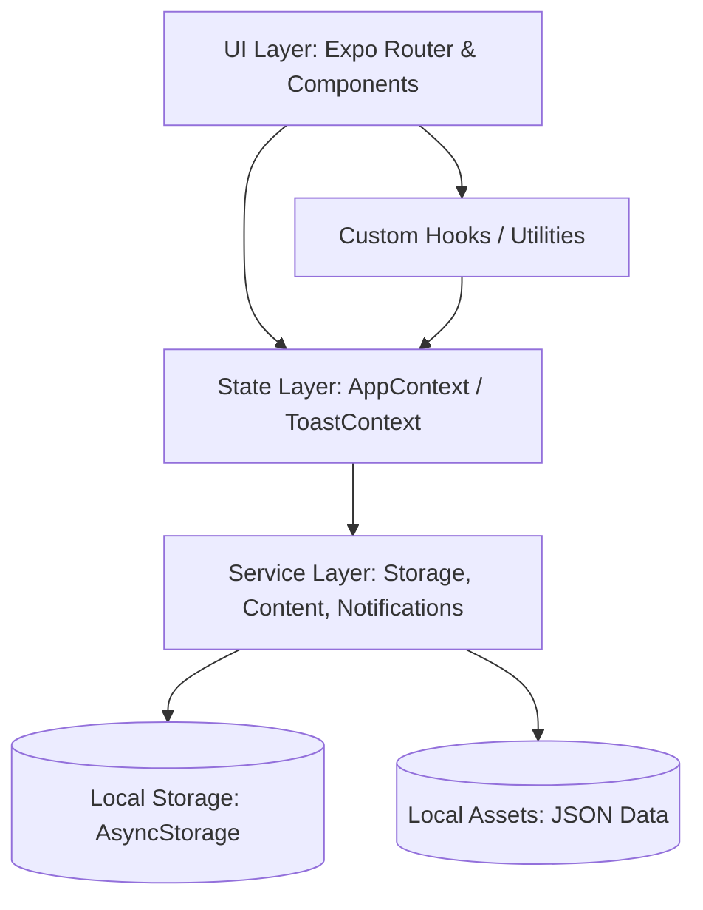

# Smoke-Free Path — Complete Technical Documentation

## 1. Executive Summary
Smoke-Free Path is a comprehensive React Native mobile application designed to guide users through a 41-day structured journey to quit smoking. It uniquely integrates behavioral science tracking with profound Islamic spirituality. The app allows users to track their progress, manage cravings through timers and exercises, read Islamic content, and earn milestones.

**Technology Stack Overview:**
- **Framework:** React Native & Expo
- **Language:** TypeScript
- **Navigation:** Expo Router
- **State Management:** React Context API with AsyncStorage
- **Styling/UI:** Custom theme provider, react-native-reanimated

**Key Features:**
- 41-Day Structured Journey (daily checklists, insights)
- Islamic Integration (daily inspirations, Duas, Niyyah reminders)
- Craving Management Timer (breathing guides, coping strategies)
- Progress & Health Tracking (smoke-free days, money saved, health timeline)
- Milestone System (achievements at key points)
- Slip-up & Trigger Logging
- Offline First (local storage)

## 2. Project Structure
```text
smoke-free-path
├── __mocks__
│   └── @react-native-async-storage
│       └── async-storage.js
├── __tests__
│   ├── integration
│   │   ├── cravingSession.integration.test.ts
│   │   ├── milestone.integration.test.ts
│   │   ├── onboarding.integration.test.ts
│   │   ├── planActivation.integration.test.ts
│   │   └── themeToggle.integration.test.ts
│   ├── property
│   │   ├── auditBugCondition.property.test.ts
│   │   ├── auditBugCondition.property.test.ts.orig
│   │   ├── auditPreservation.property.test.ts
│   │   ├── dataIntegrity.property.test.ts
│   │   ├── migration.property.test.ts
│   │   ├── milestone.property.test.ts
│   │   ├── planState.property.test.ts
│   │   ├── storage.property.test.ts
│   │   ├── streak.property.test.ts
│   │   ├── uiDeepAnalysis.property.test.ts
│   │   ├── uiTheme.property.test.ts
│   │   ├── upgrade.property.test.ts
│   │   └── utils.property.test.ts
│   └── unit
│       ├── AppContext.test.ts
│       ├── ContentService.test.ts
│       ├── dataEnrichment.test.ts
│       ├── setup.test.ts
│       └── themeTokens.test.ts
├── app
│   ├── (onboarding)
│   │   ├── _layout.tsx
│   │   ├── profile-setup.tsx
│   │   ├── quit-date.tsx
│   │   └── welcome.tsx
│   ├── (tabs)
│   │   ├── _layout.tsx
│   │   ├── dua.tsx
│   │   ├── index.tsx
│   │   ├── library.tsx
│   │   ├── progress.tsx
│   │   ├── settings.tsx
│   │   └── tracker.tsx
│   ├── craving
│   │   └── index.tsx
│   ├── milestone
│   │   └── [id].tsx
│   ├── slip-up
│   │   ├── index.tsx
│   │   └── index.tsx.orig
│   ├── tracker
│   │   └── [step].tsx
│   ├── trigger-log
│   │   └── index.tsx
│   ├── _layout.tsx
│   └── privacy-policy.tsx
├── assets
│   ├── data
│   │   ├── duas.json
│   │   ├── health_timeline.json
│   │   ├── islamic_content.json
│   │   ├── milestones.json
│   │   └── step_plans.json
│   ├── fonts
│   │   └── Amiri-Regular.ttf
│   ├── adaptive-icon.png
│   ├── custom-splash.png
│   ├── favicon.png
│   ├── icon.png
│   └── splash-icon.png
├── components
│   ├── craving
│   │   ├── ActivityList.tsx
│   │   ├── BreathingGuide.tsx
│   │   ├── DhikrGuide.tsx
│   │   ├── DuaLink.tsx
│   │   └── GroundingGuide.tsx
│   ├── onboarding
│   │   ├── ProfileForm.tsx
│   │   ├── ProfileHeader.tsx
│   │   └── StepProgress.tsx
│   ├── slip-up
│   │   ├── CigarettesInputCard.tsx
│   │   ├── DecisionCard.tsx
│   │   └── TriggerReasonCard.tsx
│   ├── ArabicText.tsx
│   ├── Card.tsx
│   ├── ChecklistItem.tsx
│   ├── ChecklistSection.tsx
│   ├── CravingTimer.tsx
│   ├── DataManager.tsx
│   ├── ErrorBoundary.tsx
│   ├── FloatingCravingButton.tsx
│   ├── FormElements.tsx
│   ├── HealthTimeline.tsx
│   ├── IslamicCard.tsx
│   ├── IslamicSection.tsx
│   ├── MilestoneAnimation.tsx
│   ├── MilestoneDetector.tsx
│   ├── MilestoneList.tsx
│   ├── MilestoneShareButton.tsx
│   ├── NotificationSettings.tsx
│   ├── ProfileEditor.tsx
│   ├── ProgressBarCard.tsx
│   ├── ProgressCalendar.tsx
│   ├── ProgressStats.tsx
│   ├── ScreenHeader.tsx
│   ├── SkeletonScreen.tsx
│   ├── StepCard.tsx
│   ├── StepNavigationBar.tsx
│   ├── Toast.tsx
│   ├── TriggerSelector.tsx
│   ├── Typography.tsx
│   └── WeeklyTriggerChart.tsx
├── constants
│   ├── calculations.ts
│   └── index.ts
├── context
│   ├── AppContext.tsx
│   └── ToastContext.tsx
├── hooks
│   ├── useCravingTimer.ts
│   ├── useMilestones.ts
│   ├── useProgressStats.ts
│   ├── useTheme.ts
│   └── useWeeklySummary.ts
├── services
│   ├── ContentService.ts
│   ├── NotificationService.ts
│   └── StorageService.ts
├── types
│   ├── enums.ts
│   └── index.ts
├── utils
│   └── trackerUtils.ts
├── .gitignore
├── README.md
├── app.json
├── babel.config.js
├── eas.json
├── expo_output.log
├── index.ts
├── jest.config.js
├── jest.setup.js
├── package-lock.json
├── package.json
├── theme.tsx
├── tsconfig.json
└── ui_ux_audit_report.md

28 directories, 123 files

```

## 3. Technology Stack
- **Node Version / Environment:** Node.js, Expo Go / React Native CLI

**Dependencies:**
- `@expo-google-fonts/amiri`: ^0.4.1
- `@expo-google-fonts/hind-siliguri`: ^0.4.1
- `@expo/metro-runtime`: ~6.1.2
- `@react-native-async-storage/async-storage`: 2.2.0
- `@react-native-community/datetimepicker`: 8.4.4
- `expo`: ~54.0.33
- `expo-blur`: ~15.0.8
- `expo-constants`: ~18.0.13
- `expo-crypto`: ~15.0.8
- `expo-document-picker`: ~14.0.8
- `expo-file-system`: ~19.0.21
- `expo-font`: ~14.0.11
- `expo-haptics`: ~15.0.8
- `expo-notifications`: ~0.32.16
- `expo-router`: ~6.0.23
- `expo-sharing`: ~14.0.8
- `expo-splash-screen`: ~31.0.13
- `expo-status-bar`: ~3.0.9
- `react`: 19.1.0
- `react-dom`: 19.1.0
- `react-native`: 0.81.5
- `react-native-reanimated`: ~4.1.1
- `react-native-safe-area-context`: ~5.6.0
- `react-native-svg`: 15.12.1
- `react-native-web`: ^0.21.0

**Dev Dependencies:**
- `@types/jest`: ^29.5.14
- `@types/react`: ~19.1.0
- `fast-check`: ^4.6.0
- `jest-expo`: ~54.0.17
- `typescript`: ~5.9.2


## 4. Architecture Overview
**Architectural Pattern:** Component-based Monolith with Layered Architecture
- **UI Layer:** React Native components & Expo Router for screens.
- **State Layer:** React Context (`AppContext`) for global state, managing a centralized store.
- **Service/Logic Layer:** Services (`ContentService`, `StorageService`, `NotificationService`) and Utilities/Hooks handling core calculations.
- **Persistence Layer:** AsyncStorage for offline-first data caching.

**High-Level Component Diagram:**


## 5. Entry Points & Application Bootstrap
- **`index.ts`**: Main entry point that registers the root component via `expo-router/entry`.
- **`app/_layout.tsx`**: Root layout wrapper. Loads fonts, checks accessibility settings, sets up `ThemeProvider`, `ToastProvider`, `AppProvider`, and runs a `NavigationGuard` which routes users to onboarding or tabs based on their profile state.
- **`context/AppContext.tsx`**: Hydrates state from AsyncStorage on initialization and maintains the global application state.

## 6. Module / Component Reference
### `.gitignore`
- **Purpose:** Application logic / Service / Utility.
- **Exported API:** None
- **Dependencies:** None
- **Internal logic:** Contains application business rules.
- **Side effects:** None
- **Data flow:** None (Static)
- **Error handling:** None
- **TODOs / Code smells:** None

### `README.md`
- **Purpose:** Documentation file
- **Exported API:** None
- **Dependencies:** None
- **Internal logic:** No internal runtime logic. Provides static configuration, text, or data structure.
- **Side effects:** None
- **Data flow:** None
- **Error handling:** None
- **TODOs / Code smells:** None

### `__mocks__/@react-native-async-storage/async-storage.js`
- **Purpose:** Static Asset / Configuration / Documentation
- **Exported API:** None
- **Dependencies:** None
- **Internal logic:** No internal runtime logic. Provides static configuration, text, or data structure.
- **Side effects:** None
- **Data flow:** None
- **Error handling:** None
- **TODOs / Code smells:** None

### `__tests__/integration/cravingSession.integration.test.ts`
- **Purpose:** Test suite.
- **Exported API:** None
- **Dependencies:** ../../types, ../../context/AppContext
- **Internal logic:** Executes tests using Jest.
- **Side effects:** None
- **Data flow:** Reads/Writes via global AppContext
- **Error handling:** None
- **TODOs / Code smells:** None

### `__tests__/integration/milestone.integration.test.ts`
- **Purpose:** Test suite.
- **Exported API:** None
- **Dependencies:** ../../context/AppContext
- **Internal logic:** Executes tests using Jest.
- **Side effects:** None
- **Data flow:** Reads/Writes via global AppContext
- **Error handling:** None
- **TODOs / Code smells:** None

### `__tests__/integration/onboarding.integration.test.ts`
- **Purpose:** Test suite.
- **Exported API:** None
- **Dependencies:** ../../types, ../../context/AppContext
- **Internal logic:** Executes tests using Jest.
- **Side effects:** None
- **Data flow:** Reads/Writes via global AppContext
- **Error handling:** None
- **TODOs / Code smells:** None

### `__tests__/integration/planActivation.integration.test.ts`
- **Purpose:** Test suite.
- **Exported API:** None
- **Dependencies:** ../../context/AppContext
- **Internal logic:** Executes tests using Jest.
- **Side effects:** None
- **Data flow:** Reads/Writes via global AppContext
- **Error handling:** None
- **TODOs / Code smells:** None

### `__tests__/integration/themeToggle.integration.test.ts`
- **Purpose:** Test suite.
- **Exported API:** None
- **Dependencies:** @react-native-async-storage/async-storage
- **Internal logic:** Executes tests using Jest.
- **Side effects:** I/O: Device Storage
- **Data flow:** None (Static)
- **Error handling:** None
- **TODOs / Code smells:** None

### `__tests__/property/auditBugCondition.property.test.ts`
- **Purpose:** Test suite.
- **Exported API:** None
- **Dependencies:** @/constants, @/types, fast-check, @/utils/trackerUtils
- **Internal logic:** Executes tests using Jest. Property-based testing via fast-check.
- **Side effects:** I/O: Local File Read
- **Data flow:** Reads/Writes via global AppContext, Accepts React props
- **Error handling:** Try/Catch blocks
- **TODOs / Code smells:** None

### `__tests__/property/auditBugCondition.property.test.ts.orig`
- **Purpose:** Static Asset / Configuration / Documentation
- **Exported API:** None
- **Dependencies:** None
- **Internal logic:** No internal runtime logic. Provides static configuration, text, or data structure.
- **Side effects:** None
- **Data flow:** None
- **Error handling:** None
- **TODOs / Code smells:** None

### `__tests__/property/auditPreservation.property.test.ts`
- **Purpose:** Test suite.
- **Exported API:** None
- **Dependencies:** @/context/AppContext, @/utils/trackerUtils, @/constants, @/types, fast-check
- **Internal logic:** Executes tests using Jest. Property-based testing via fast-check.
- **Side effects:** None
- **Data flow:** Reads/Writes via global AppContext, Accepts React props
- **Error handling:** None
- **TODOs / Code smells:** None

### `__tests__/property/dataIntegrity.property.test.ts`
- **Purpose:** Test suite.
- **Exported API:** None
- **Dependencies:** @/assets/data/step_plans.json, @/assets/data/health_timeline.json, @/assets/data/islamic_content.json, @/assets/data/milestones.json, fast-check, @/assets/data/duas.json
- **Internal logic:** Executes tests using Jest. Property-based testing via fast-check.
- **Side effects:** None
- **Data flow:** None (Static)
- **Error handling:** None
- **TODOs / Code smells:** None

### `__tests__/property/migration.property.test.ts`
- **Purpose:** Test suite.
- **Exported API:** None
- **Dependencies:** @/context/AppContext, fast-check
- **Internal logic:** Executes tests using Jest. Property-based testing via fast-check.
- **Side effects:** None
- **Data flow:** Reads/Writes via global AppContext, Accepts React props
- **Error handling:** None
- **TODOs / Code smells:** None

### `__tests__/property/milestone.property.test.ts`
- **Purpose:** Test suite.
- **Exported API:** None
- **Dependencies:** @/components/MilestoneShareButton, fast-check, @/types
- **Internal logic:** Executes tests using Jest. Property-based testing via fast-check.
- **Side effects:** None
- **Data flow:** Accepts React props
- **Error handling:** None
- **TODOs / Code smells:** None

### `__tests__/property/planState.property.test.ts`
- **Purpose:** Test suite.
- **Exported API:** None
- **Dependencies:** @/context/AppContext, fast-check, @/types
- **Internal logic:** Executes tests using Jest. Property-based testing via fast-check.
- **Side effects:** None
- **Data flow:** Reads/Writes via global AppContext, Accepts React props
- **Error handling:** None
- **TODOs / Code smells:** None

### `__tests__/property/storage.property.test.ts`
- **Purpose:** Test suite.
- **Exported API:** None
- **Dependencies:** @/services/StorageService, @/context/AppContext, fast-check, @/types
- **Internal logic:** Executes tests using Jest. Property-based testing via fast-check.
- **Side effects:** None
- **Data flow:** Reads/Writes via global AppContext, Accepts React props
- **Error handling:** None
- **TODOs / Code smells:** None

### `__tests__/property/streak.property.test.ts`
- **Purpose:** Test suite.
- **Exported API:** None
- **Dependencies:** @/context/AppContext, fast-check, @/types
- **Internal logic:** Executes tests using Jest. Property-based testing via fast-check.
- **Side effects:** None
- **Data flow:** Reads/Writes via global AppContext, Accepts React props
- **Error handling:** None
- **TODOs / Code smells:** None

### `__tests__/property/uiDeepAnalysis.property.test.ts`
- **Purpose:** Test suite.
- **Exported API:** None
- **Dependencies:** fs, path, fast-check, @/components/CravingTimer
- **Internal logic:** Executes tests using Jest. Property-based testing via fast-check.
- **Side effects:** None
- **Data flow:** Accepts React props
- **Error handling:** None
- **TODOs / Code smells:** None

### `__tests__/property/uiTheme.property.test.ts`
- **Purpose:** Test suite.
- **Exported API:** computeAnimationState
- **Dependencies:** ../../app/(tabs)/dua, ../../components/TriggerSelector, ../../theme, fast-check
- **Internal logic:** Executes tests using Jest. Property-based testing via fast-check.
- **Side effects:** None
- **Data flow:** Accepts React props
- **Error handling:** None
- **TODOs / Code smells:** None

### `__tests__/property/upgrade.property.test.ts`
- **Purpose:** Test suite.
- **Exported API:** None
- **Dependencies:** @react-native-async-storage/async-storage, ../../types, ../../theme, ../../components/ErrorBoundary, fast-check, expo-haptics, ../../services/StorageService, ../../utils/trackerUtils
- **Internal logic:** Executes tests using Jest. Property-based testing via fast-check.
- **Side effects:** I/O: Device Storage, I/O: Local File Read
- **Data flow:** Reads/Writes via global AppContext, Accepts React props
- **Error handling:** Try/Catch blocks, React Error Boundary wrapper
- **TODOs / Code smells:** None

### `__tests__/property/utils.property.test.ts`
- **Purpose:** Test suite.
- **Exported API:** None
- **Dependencies:** expo-notifications, @/services/NotificationService, fast-check, @/types
- **Internal logic:** Executes tests using Jest. Property-based testing via fast-check.
- **Side effects:** Side Effect: Local Push Notification
- **Data flow:** Accepts React props
- **Error handling:** None
- **TODOs / Code smells:** None

### `__tests__/unit/AppContext.test.ts`
- **Purpose:** Test suite.
- **Exported API:** None
- **Dependencies:** ../../types, ../../context/AppContext
- **Internal logic:** Executes tests using Jest.
- **Side effects:** None
- **Data flow:** Reads/Writes via global AppContext
- **Error handling:** None
- **TODOs / Code smells:** None

### `__tests__/unit/ContentService.test.ts`
- **Purpose:** Test suite.
- **Exported API:** None
- **Dependencies:** ../../services/ContentService
- **Internal logic:** Executes tests using Jest.
- **Side effects:** None
- **Data flow:** None (Static)
- **Error handling:** None
- **TODOs / Code smells:** None

### `__tests__/unit/dataEnrichment.test.ts`
- **Purpose:** Test suite.
- **Exported API:** None
- **Dependencies:** @/assets/data/milestones.json, @/assets/data/step_plans.json, @/assets/data/duas.json
- **Internal logic:** Executes tests using Jest.
- **Side effects:** None
- **Data flow:** None (Static)
- **Error handling:** None
- **TODOs / Code smells:** None

### `__tests__/unit/setup.test.ts`
- **Purpose:** Test suite.
- **Exported API:** None
- **Dependencies:** None
- **Internal logic:** Executes tests using Jest. Property-based testing via fast-check.
- **Side effects:** None
- **Data flow:** None (Static)
- **Error handling:** None
- **TODOs / Code smells:** None

### `__tests__/unit/themeTokens.test.ts`
- **Purpose:** Test suite.
- **Exported API:** None
- **Dependencies:** ../../theme
- **Internal logic:** Executes tests using Jest.
- **Side effects:** None
- **Data flow:** None (Static)
- **Error handling:** None
- **TODOs / Code smells:** None

### `app.json`
- **Purpose:** Expo Platform Configuration
- **Exported API:** None
- **Dependencies:** None
- **Internal logic:** No internal runtime logic. Provides static configuration, text, or data structure.
- **Side effects:** None
- **Data flow:** None
- **Error handling:** None
- **TODOs / Code smells:** None

### `app/(onboarding)/_layout.tsx`
- **Purpose:** Expo Router Screen Component.
- **Exported API:** OnboardingLayout
- **Dependencies:** expo-router
- **Internal logic:** Acts as a routable page view.
- **Side effects:** None
- **Data flow:** None (Static)
- **Error handling:** None
- **TODOs / Code smells:** None

### `app/(onboarding)/profile-setup.tsx`
- **Purpose:** Expo Router Screen Component.
- **Exported API:** ProfileSetupScreen
- **Dependencies:** @/context/AppContext, react, expo-router, @/hooks/useTheme, @/components/onboarding/ProfileHeader, @/components/onboarding/StepProgress, @/services/StorageService, @/components/Typography, react-native-safe-area-context
- **Internal logic:** Acts as a routable page view.
- **Side effects:** None
- **Data flow:** Reads/Writes via global AppContext, Takes route parameters, Accepts React props
- **Error handling:** Try/Catch blocks, User-facing Alert Errors
- **TODOs / Code smells:** None

### `app/(onboarding)/quit-date.tsx`
- **Purpose:** Expo Router Screen Component.
- **Exported API:** QuitDateScreen
- **Dependencies:** @/context/AppContext, react, expo-router, @/hooks/useTheme, @/components/onboarding/StepProgress, @/types, @/services/StorageService, @/components/Typography, react-native-safe-area-context
- **Internal logic:** Acts as a routable page view.
- **Side effects:** None
- **Data flow:** Reads/Writes via global AppContext, Takes route parameters, Accepts React props
- **Error handling:** Try/Catch blocks, User-facing Alert Errors
- **TODOs / Code smells:** None

### `app/(onboarding)/welcome.tsx`
- **Purpose:** Expo Router Screen Component.
- **Exported API:** WelcomeScreen
- **Dependencies:** react-native, expo-router, @/hooks/useTheme, @/components/onboarding/StepProgress, @/components/Typography, react-native-safe-area-context
- **Internal logic:** Acts as a routable page view.
- **Side effects:** None
- **Data flow:** Takes route parameters
- **Error handling:** None
- **TODOs / Code smells:** None

### `app/(tabs)/_layout.tsx`
- **Purpose:** Expo Router Screen Component.
- **Exported API:** TabsLayout
- **Dependencies:** @/components/MilestoneDetector, @expo/vector-icons, react-native, react, ../../theme, expo-router, @/components/FloatingCravingButton
- **Internal logic:** Acts as a routable page view.
- **Side effects:** None
- **Data flow:** Accepts React props
- **Error handling:** None
- **TODOs / Code smells:** None

### `app/(tabs)/dua.tsx`
- **Purpose:** Expo Router Screen Component.
- **Exported API:** DuaScreen, getDefaultDuaCategory
- **Dependencies:** @/components/ScreenHeader, react, @/hooks/useTheme, @/components/IslamicCard, @/components/ArabicText, @/services/ContentService, @/types, @/components/Typography, react-native-safe-area-context
- **Internal logic:** Acts as a routable page view.
- **Side effects:** None
- **Data flow:** Accepts React props
- **Error handling:** None
- **TODOs / Code smells:** None

### `app/(tabs)/index.tsx`
- **Purpose:** Expo Router Screen Component.
- **Exported API:** HomeScreen
- **Dependencies:** @/context/AppContext, @expo/vector-icons, react, expo-router, @/components/Card, react-native-reanimated, @/hooks/useTheme, @/hooks/useProgressStats, @/components/IslamicCard, @/components/SkeletonScreen, @/services/ContentService, @/services/StorageService, @/components/Typography, expo-blur, react-native-safe-area-context
- **Internal logic:** Acts as a routable page view.
- **Side effects:** None
- **Data flow:** Reads/Writes via global AppContext, Takes route parameters, Accepts React props
- **Error handling:** None
- **TODOs / Code smells:** None

### `app/(tabs)/library.tsx`
- **Purpose:** Expo Router Screen Component.
- **Exported API:** LibraryScreen
- **Dependencies:** @/context/AppContext, @/components/ScreenHeader, react, @/hooks/useTheme, @/components/IslamicCard, @/components/ArabicText, @/services/ContentService, @/types, @/components/Typography, @/components/SkeletonScreen, react-native-safe-area-context
- **Internal logic:** Acts as a routable page view.
- **Side effects:** None
- **Data flow:** Reads/Writes via global AppContext, Accepts React props
- **Error handling:** None
- **TODOs / Code smells:** None

### `app/(tabs)/progress.tsx`
- **Purpose:** Expo Router Screen Component.
- **Exported API:** ProgressScreen
- **Dependencies:** @react-native-async-storage/async-storage, @/hooks/useMilestones, @/services/StorageService, @/components/WeeklyTriggerChart, @/components/ProgressCalendar, @/components/MilestoneList, expo-router, react-native-reanimated, @/components/Typography, @/components/ScreenHeader, @/utils/trackerUtils, @/components/Card, @/components/ProgressBarCard, @/context/AppContext, @/components/HealthTimeline, react, @/components/ProgressStats, @/hooks/useTheme, @/hooks/useProgressStats, @/constants, @/types, react-native-safe-area-context
- **Internal logic:** Acts as a routable page view.
- **Side effects:** I/O: Device Storage
- **Data flow:** Reads/Writes via global AppContext, Takes route parameters, Accepts React props
- **Error handling:** Try/Catch blocks, Promise Catch Handlers
- **TODOs / Code smells:** None

### `app/(tabs)/settings.tsx`
- **Purpose:** Expo Router Screen Component.
- **Exported API:** SettingsScreen
- **Dependencies:** @/context/AppContext, @/context/ToastContext, react-native, @/utils/trackerUtils, react, @/components/NotificationSettings, expo-router, @/services/NotificationService, @/components/DataManager, @/hooks/useTheme, @/components/Card, @/components/ProfileEditor, expo-haptics, @/services/ContentService, @/types, @/components/Typography, react-native-safe-area-context
- **Internal logic:** Acts as a routable page view.
- **Side effects:** None
- **Data flow:** Reads/Writes via global AppContext, Takes route parameters, Accepts React props
- **Error handling:** Try/Catch blocks, User-facing Alert Errors
- **TODOs / Code smells:** None

### `app/(tabs)/tracker.tsx`
- **Purpose:** Expo Router Screen Component.
- **Exported API:** TrackerScreen
- **Dependencies:** @/context/AppContext, @/components/ScreenHeader, @/components/StepCard, @/utils/trackerUtils, react, expo-router, @/components/Card, @/hooks/useTheme, @/constants, @/components/Typography, react-native-safe-area-context
- **Internal logic:** Acts as a routable page view.
- **Side effects:** None
- **Data flow:** Reads/Writes via global AppContext, Takes route parameters, Accepts React props
- **Error handling:** None
- **TODOs / Code smells:** None

### `app/_layout.tsx`
- **Purpose:** Expo Router Screen Component.
- **Exported API:** RootLayout
- **Dependencies:** expo-splash-screen, @/context/AppContext, @/context/ToastContext, react-native, react, @/components/ErrorBoundary, expo-router, @expo-google-fonts/hind-siliguri, expo-font, @/services/NotificationService, ../theme, @/services/StorageService
- **Internal logic:** Acts as a routable page view.
- **Side effects:** None
- **Data flow:** Reads/Writes via global AppContext, Takes route parameters
- **Error handling:** React Error Boundary wrapper
- **TODOs / Code smells:** None

### `app/craving/index.tsx`
- **Purpose:** Expo Router Screen Component.
- **Exported API:** CravingScreen
- **Dependencies:** @/context/AppContext, @/components/craving/BreathingGuide, @/components/craving/DuaLink, react, expo-crypto, @/components/craving/GroundingGuide, expo-router, @/components/Card, @/components/CravingTimer, @/hooks/useTheme, @/components/craving/ActivityList, @/components/TriggerSelector, @/components/craving/DhikrGuide, expo-haptics, @/types, @/components/Typography, react-native-safe-area-context
- **Internal logic:** Acts as a routable page view.
- **Side effects:** None
- **Data flow:** Reads/Writes via global AppContext, Takes route parameters, Accepts React props
- **Error handling:** Try/Catch blocks
- **TODOs / Code smells:** None

### `app/milestone/[id].tsx`
- **Purpose:** Expo Router Screen Component.
- **Exported API:** MilestoneScreen
- **Dependencies:** react, @/theme, @/components/MilestoneAnimation, expo-router, @/components/MilestoneShareButton, @/components/IslamicCard, @/services/ContentService, expo-haptics, @/components/Typography, react-native-safe-area-context
- **Internal logic:** Acts as a routable page view.
- **Side effects:** None
- **Data flow:** Takes route parameters
- **Error handling:** Try/Catch blocks
- **TODOs / Code smells:** None

### `app/privacy-policy.tsx`
- **Purpose:** Expo Router Screen Component.
- **Exported API:** PrivacyPolicyScreen
- **Dependencies:** react-native, react, expo-router, @/hooks/useTheme, react-native-safe-area-context
- **Internal logic:** Acts as a routable page view.
- **Side effects:** None
- **Data flow:** Takes route parameters
- **Error handling:** None
- **TODOs / Code smells:** None

### `app/slip-up/index.tsx`
- **Purpose:** Expo Router Screen Component.
- **Exported API:** SlipUpScreen
- **Dependencies:** @/context/AppContext, react, expo-crypto, expo-router, @/hooks/useTheme, @/components/slip-up/CigarettesInputCard, @/components/IslamicCard, @/components/slip-up/DecisionCard, @/components/slip-up/TriggerReasonCard, expo-haptics, @/services/ContentService, @/types, @/components/Typography, react-native-safe-area-context
- **Internal logic:** Acts as a routable page view.
- **Side effects:** None
- **Data flow:** Reads/Writes via global AppContext, Takes route parameters, Accepts React props
- **Error handling:** Try/Catch blocks
- **TODOs / Code smells:** None

### `app/slip-up/index.tsx.orig`
- **Purpose:** Static Asset / Configuration / Documentation
- **Exported API:** None
- **Dependencies:** None
- **Internal logic:** No internal runtime logic. Provides static configuration, text, or data structure.
- **Side effects:** None
- **Data flow:** None
- **Error handling:** None
- **TODOs / Code smells:** None

### `app/tracker/[step].tsx`
- **Purpose:** Expo Router Screen Component.
- **Exported API:** StepPlanScreen
- **Dependencies:** @/context/AppContext, react-native, @/utils/trackerUtils, react, expo-router, @/components/StepNavigationBar, @/components/ChecklistSection, @/hooks/useTheme, @/components/IslamicSection, expo-haptics, @/services/ContentService, @/components/Typography, react-native-safe-area-context
- **Internal logic:** Acts as a routable page view.
- **Side effects:** None
- **Data flow:** Reads/Writes via global AppContext, Takes route parameters, Accepts React props
- **Error handling:** Try/Catch blocks
- **TODOs / Code smells:** None

### `app/trigger-log/index.tsx`
- **Purpose:** Expo Router Screen Component.
- **Exported API:** TriggerLogScreen
- **Dependencies:** @/context/AppContext, @/utils/trackerUtils, react, expo-router, @/components/Card, @/hooks/useTheme, @/components/TriggerSelector, expo-haptics, @/services/ContentService, @/constants, @/components/Typography, @/types, react-native-safe-area-context
- **Internal logic:** Acts as a routable page view.
- **Side effects:** None
- **Data flow:** Reads/Writes via global AppContext, Takes route parameters, Accepts React props
- **Error handling:** Try/Catch blocks, User-facing Alert Errors
- **TODOs / Code smells:** None

### `assets/adaptive-icon.png`
- **Purpose:** Static Asset / Configuration / Documentation
- **Exported API:** None
- **Dependencies:** None
- **Internal logic:** No internal runtime logic. Provides static configuration, text, or data structure.
- **Side effects:** None
- **Data flow:** None
- **Error handling:** None
- **TODOs / Code smells:** None

### `assets/custom-splash.png`
- **Purpose:** Static Asset / Configuration / Documentation
- **Exported API:** None
- **Dependencies:** None
- **Internal logic:** No internal runtime logic. Provides static configuration, text, or data structure.
- **Side effects:** None
- **Data flow:** None
- **Error handling:** None
- **TODOs / Code smells:** None

### `assets/data/duas.json`
- **Purpose:** Local JSON Database Content
- **Exported API:** None
- **Dependencies:** None
- **Internal logic:** No internal runtime logic. Provides static configuration, text, or data structure.
- **Side effects:** None
- **Data flow:** None
- **Error handling:** None
- **TODOs / Code smells:** None

### `assets/data/health_timeline.json`
- **Purpose:** Local JSON Database Content
- **Exported API:** None
- **Dependencies:** None
- **Internal logic:** No internal runtime logic. Provides static configuration, text, or data structure.
- **Side effects:** None
- **Data flow:** None
- **Error handling:** None
- **TODOs / Code smells:** None

### `assets/data/islamic_content.json`
- **Purpose:** Local JSON Database Content
- **Exported API:** None
- **Dependencies:** None
- **Internal logic:** No internal runtime logic. Provides static configuration, text, or data structure.
- **Side effects:** None
- **Data flow:** None
- **Error handling:** None
- **TODOs / Code smells:** None

### `assets/data/milestones.json`
- **Purpose:** Local JSON Database Content
- **Exported API:** None
- **Dependencies:** None
- **Internal logic:** No internal runtime logic. Provides static configuration, text, or data structure.
- **Side effects:** None
- **Data flow:** None
- **Error handling:** None
- **TODOs / Code smells:** None

### `assets/data/step_plans.json`
- **Purpose:** Local JSON Database Content
- **Exported API:** None
- **Dependencies:** None
- **Internal logic:** No internal runtime logic. Provides static configuration, text, or data structure.
- **Side effects:** None
- **Data flow:** None
- **Error handling:** None
- **TODOs / Code smells:** None

### `assets/favicon.png`
- **Purpose:** Static Asset / Configuration / Documentation
- **Exported API:** None
- **Dependencies:** None
- **Internal logic:** No internal runtime logic. Provides static configuration, text, or data structure.
- **Side effects:** None
- **Data flow:** None
- **Error handling:** None
- **TODOs / Code smells:** None

### `assets/fonts/Amiri-Regular.ttf`
- **Purpose:** Static Asset / Configuration / Documentation
- **Exported API:** None
- **Dependencies:** None
- **Internal logic:** No internal runtime logic. Provides static configuration, text, or data structure.
- **Side effects:** None
- **Data flow:** None
- **Error handling:** None
- **TODOs / Code smells:** None

### `assets/icon.png`
- **Purpose:** Static Asset / Configuration / Documentation
- **Exported API:** None
- **Dependencies:** None
- **Internal logic:** No internal runtime logic. Provides static configuration, text, or data structure.
- **Side effects:** None
- **Data flow:** None
- **Error handling:** None
- **TODOs / Code smells:** None

### `assets/splash-icon.png`
- **Purpose:** Static Asset / Configuration / Documentation
- **Exported API:** None
- **Dependencies:** None
- **Internal logic:** No internal runtime logic. Provides static configuration, text, or data structure.
- **Side effects:** None
- **Data flow:** None
- **Error handling:** None
- **TODOs / Code smells:** None

### `babel.config.js`
- **Purpose:** Static Asset / Configuration / Documentation
- **Exported API:** None
- **Dependencies:** None
- **Internal logic:** No internal runtime logic. Provides static configuration, text, or data structure.
- **Side effects:** None
- **Data flow:** None
- **Error handling:** None
- **TODOs / Code smells:** None

### `components/ArabicText.tsx`
- **Purpose:** React component.
- **Exported API:** ArabicText
- **Dependencies:** react, @/hooks/useTheme, react-native
- **Internal logic:** Renders UI view.
- **Side effects:** None
- **Data flow:** Accepts React props
- **Error handling:** None
- **TODOs / Code smells:** None

### `components/Card.tsx`
- **Purpose:** React component.
- **Exported API:** Card
- **Dependencies:** react, react-native, expo-haptics, ../theme
- **Internal logic:** Renders UI view. Handles user interactions.
- **Side effects:** None
- **Data flow:** Accepts React props
- **Error handling:** Promise Catch Handlers
- **TODOs / Code smells:** None

### `components/ChecklistItem.tsx`
- **Purpose:** React component.
- **Exported API:** Default: React
- **Dependencies:** react-native, react, ./Typography, ../theme, @/types
- **Internal logic:** Renders UI view. Handles user interactions.
- **Side effects:** None
- **Data flow:** Accepts React props
- **Error handling:** None
- **TODOs / Code smells:** None

### `components/ChecklistSection.tsx`
- **Purpose:** React component.
- **Exported API:** ChecklistSection
- **Dependencies:** react-native, react, @/hooks/useTheme, @/components/ChecklistItem, @/types, @/components/Typography
- **Internal logic:** Renders UI view. Handles user interactions.
- **Side effects:** None
- **Data flow:** None (Static)
- **Error handling:** None
- **TODOs / Code smells:** None

### `components/CravingTimer.tsx`
- **Purpose:** React component.
- **Exported API:** CravingTimer, computeStrokeDashoffset, CIRCUMFERENCE, TOTAL_SECONDS
- **Dependencies:** react-native, react, react-native-svg, react-native-reanimated, @/hooks/useTheme, @/hooks/useCravingTimer, @/components/Typography
- **Internal logic:** Renders UI view. Handles user interactions.
- **Side effects:** None
- **Data flow:** Accepts React props
- **Error handling:** None
- **TODOs / Code smells:** None

### `components/DataManager.tsx`
- **Purpose:** React component.
- **Exported API:** DataManager
- **Dependencies:** react, expo-document-picker, expo-file-system/legacy, @/hooks/useTheme, expo-sharing, @/types, @/components/Typography
- **Internal logic:** Renders UI view. Handles user interactions.
- **Side effects:** None
- **Data flow:** Accepts React props
- **Error handling:** Try/Catch blocks
- **TODOs / Code smells:** None

### `components/ErrorBoundary.tsx`
- **Purpose:** React component.
- **Exported API:** ErrorBoundary
- **Dependencies:** react, react-native
- **Internal logic:** Renders UI view. Handles user interactions.
- **Side effects:** None
- **Data flow:** Accepts React props
- **Error handling:** React Error Boundary wrapper
- **TODOs / Code smells:** None

### `components/FloatingCravingButton.tsx`
- **Purpose:** React component.
- **Exported API:** FloatingCravingButton
- **Dependencies:** @expo/vector-icons, react-native, react, expo-router, @/hooks/useTheme
- **Internal logic:** Renders UI view. Handles user interactions.
- **Side effects:** None
- **Data flow:** Takes route parameters
- **Error handling:** None
- **TODOs / Code smells:** None

### `components/FormElements.tsx`
- **Purpose:** React component.
- **Exported API:** FormInput, FormSwitchRow
- **Dependencies:** react, ./Typography, ../theme
- **Internal logic:** Renders UI view. Handles user interactions.
- **Side effects:** None
- **Data flow:** Accepts React props
- **Error handling:** None
- **TODOs / Code smells:** None

### `components/HealthTimeline.tsx`
- **Purpose:** React component.
- **Exported API:** HealthTimeline
- **Dependencies:** react-native, react, @/services/ContentService, ../theme, @/components/Typography
- **Internal logic:** Renders UI view.
- **Side effects:** None
- **Data flow:** Accepts React props
- **Error handling:** None
- **TODOs / Code smells:** None

### `components/IslamicCard.tsx`
- **Purpose:** React component.
- **Exported API:** Default: React
- **Dependencies:** react-native, react, @/hooks/useTheme, @/components/ArabicText, expo-haptics, @/types, @/components/Typography
- **Internal logic:** Renders UI view. Handles user interactions.
- **Side effects:** None
- **Data flow:** None (Static)
- **Error handling:** Try/Catch blocks
- **TODOs / Code smells:** None

### `components/IslamicSection.tsx`
- **Purpose:** React component.
- **Exported API:** IslamicSection
- **Dependencies:** react-native, react, @/hooks/useTheme, @/components/IslamicCard, @/types, @/components/Typography
- **Internal logic:** Renders UI view.
- **Side effects:** None
- **Data flow:** None (Static)
- **Error handling:** None
- **TODOs / Code smells:** None

### `components/MilestoneAnimation.tsx`
- **Purpose:** React component.
- **Exported API:** MilestoneAnimation
- **Dependencies:** react, ./Typography, react-native, ../theme
- **Internal logic:** Renders UI view.
- **Side effects:** None
- **Data flow:** Accepts React props
- **Error handling:** None
- **TODOs / Code smells:** None

### `components/MilestoneDetector.tsx`
- **Purpose:** React component.
- **Exported API:** MilestoneDetector
- **Dependencies:** react, @/context/AppContext, expo-router, @/utils/trackerUtils
- **Internal logic:** Renders UI view.
- **Side effects:** None
- **Data flow:** Reads/Writes via global AppContext, Takes route parameters
- **Error handling:** None
- **TODOs / Code smells:** None

### `components/MilestoneList.tsx`
- **Purpose:** React component.
- **Exported API:** MilestoneList
- **Dependencies:** react-native, react, @/constants, @/services/ContentService, ../theme
- **Internal logic:** Renders UI view.
- **Side effects:** None
- **Data flow:** Accepts React props
- **Error handling:** None
- **TODOs / Code smells:** None

### `components/MilestoneShareButton.tsx`
- **Purpose:** React component.
- **Exported API:** MilestoneShareButton, composeShareMessage
- **Dependencies:** react-native, react, @/theme, @/types, @/components/Typography
- **Internal logic:** Renders UI view. Handles user interactions.
- **Side effects:** None
- **Data flow:** Accepts React props
- **Error handling:** Try/Catch blocks
- **TODOs / Code smells:** None

### `components/NotificationSettings.tsx`
- **Purpose:** React component.
- **Exported API:** NotificationSettings
- **Dependencies:** ./FormElements, react, @react-native-community/datetimepicker, @/services/NotificationService, @/hooks/useTheme, @/types, @/components/Typography
- **Internal logic:** Renders UI view. Handles user interactions.
- **Side effects:** None
- **Data flow:** None (Static)
- **Error handling:** None
- **TODOs / Code smells:** None

### `components/ProfileEditor.tsx`
- **Purpose:** React component.
- **Exported API:** ProfileEditor
- **Dependencies:** ./FormElements, react, @/hooks/useTheme, @/types, @/components/Typography
- **Internal logic:** Renders UI view. Handles user interactions.
- **Side effects:** None
- **Data flow:** Accepts React props
- **Error handling:** None
- **TODOs / Code smells:** None

### `components/ProgressBarCard.tsx`
- **Purpose:** React component.
- **Exported API:** ProgressBarCard
- **Dependencies:** react-native, react, @/components/Card, @/hooks/useTheme, @/components/Typography
- **Internal logic:** Renders UI view.
- **Side effects:** None
- **Data flow:** Accepts React props
- **Error handling:** None
- **TODOs / Code smells:** None

### `components/ProgressCalendar.tsx`
- **Purpose:** React component.
- **Exported API:** ProgressCalendar
- **Dependencies:** react-native, @/utils/trackerUtils, react, expo-router, ../theme, @/types, ./StepCard
- **Internal logic:** Renders UI view.
- **Side effects:** None
- **Data flow:** Takes route parameters, Accepts React props
- **Error handling:** None
- **TODOs / Code smells:** None

### `components/ProgressStats.tsx`
- **Purpose:** React component.
- **Exported API:** ProgressStats
- **Dependencies:** react, @/components/Typography, @/hooks/useTheme, react-native
- **Internal logic:** Renders UI view.
- **Side effects:** None
- **Data flow:** Accepts React props
- **Error handling:** None
- **TODOs / Code smells:** None

### `components/ScreenHeader.tsx`
- **Purpose:** React component.
- **Exported API:** ScreenHeader
- **Dependencies:** react-native, react, ./Typography, ../theme, expo-blur
- **Internal logic:** Renders UI view.
- **Side effects:** None
- **Data flow:** Accepts React props
- **Error handling:** None
- **TODOs / Code smells:** None

### `components/SkeletonScreen.tsx`
- **Purpose:** React component.
- **Exported API:** SkeletonScreen
- **Dependencies:** react, ../hooks/useTheme, react-native
- **Internal logic:** Renders UI view.
- **Side effects:** None
- **Data flow:** Accepts React props
- **Error handling:** None
- **TODOs / Code smells:** None

### `components/StepCard.tsx`
- **Purpose:** React component.
- **Exported API:** Default: React
- **Dependencies:** react-native, react, ./Typography, expo-haptics, ../theme, @/types
- **Internal logic:** Renders UI view. Handles user interactions.
- **Side effects:** None
- **Data flow:** Accepts React props
- **Error handling:** Promise Catch Handlers
- **TODOs / Code smells:** None

### `components/StepNavigationBar.tsx`
- **Purpose:** React component.
- **Exported API:** StepNavigationBar
- **Dependencies:** react-native, @/utils/trackerUtils, react, @/hooks/useTheme, @/types, @/components/Typography
- **Internal logic:** Renders UI view. Handles user interactions.
- **Side effects:** None
- **Data flow:** None (Static)
- **Error handling:** None
- **TODOs / Code smells:** None

### `components/Toast.tsx`
- **Purpose:** React component.
- **Exported API:** Toast
- **Dependencies:** react, react-native, ../theme
- **Internal logic:** Renders UI view.
- **Side effects:** None
- **Data flow:** None (Static)
- **Error handling:** None
- **TODOs / Code smells:** None

### `components/TriggerSelector.tsx`
- **Purpose:** React component.
- **Exported API:** computeNextSelection, TriggerSelector
- **Dependencies:** react, react-native, ../theme, @/types
- **Internal logic:** Renders UI view. Handles user interactions.
- **Side effects:** None
- **Data flow:** Accepts React props
- **Error handling:** None
- **TODOs / Code smells:** None

### `components/Typography.tsx`
- **Purpose:** React component.
- **Exported API:** TypographyVariant, TypographyColor, Typography
- **Dependencies:** react, react-native, ../theme
- **Internal logic:** Renders UI view.
- **Side effects:** None
- **Data flow:** None (Static)
- **Error handling:** None
- **TODOs / Code smells:** None

### `components/WeeklyTriggerChart.tsx`
- **Purpose:** React component.
- **Exported API:** WeeklyTriggerChart
- **Dependencies:** @/context/AppContext, @/hooks/useWeeklySummary, react-native, react, expo-router, @/components/Card, @/hooks/useTheme, @/constants, @/types, @/components/Typography
- **Internal logic:** Renders UI view. Handles user interactions.
- **Side effects:** None
- **Data flow:** Reads/Writes via global AppContext, Takes route parameters, Accepts React props
- **Error handling:** None
- **TODOs / Code smells:** None

### `components/craving/ActivityList.tsx`
- **Purpose:** React component.
- **Exported API:** ActivityList
- **Dependencies:** react, @/hooks/useTheme, react-native
- **Internal logic:** Renders UI view.
- **Side effects:** None
- **Data flow:** None (Static)
- **Error handling:** None
- **TODOs / Code smells:** None

### `components/craving/BreathingGuide.tsx`
- **Purpose:** React component.
- **Exported API:** BreathingGuide
- **Dependencies:** react, @/components/Typography, @/hooks/useTheme, react-native
- **Internal logic:** Renders UI view.
- **Side effects:** None
- **Data flow:** None (Static)
- **Error handling:** None
- **TODOs / Code smells:** None

### `components/craving/DhikrGuide.tsx`
- **Purpose:** React component.
- **Exported API:** DhikrGuide
- **Dependencies:** react-native, react, @/hooks/useTheme, expo-haptics, @/components/Typography
- **Internal logic:** Renders UI view. Handles user interactions.
- **Side effects:** None
- **Data flow:** None (Static)
- **Error handling:** Try/Catch blocks
- **TODOs / Code smells:** None

### `components/craving/DuaLink.tsx`
- **Purpose:** React component.
- **Exported API:** DuaLink
- **Dependencies:** react, @/hooks/useTheme, react-native
- **Internal logic:** Renders UI view. Handles user interactions.
- **Side effects:** None
- **Data flow:** Accepts React props
- **Error handling:** None
- **TODOs / Code smells:** None

### `components/craving/GroundingGuide.tsx`
- **Purpose:** React component.
- **Exported API:** GroundingGuide
- **Dependencies:** react, @/components/Typography, @/hooks/useTheme, react-native
- **Internal logic:** Renders UI view.
- **Side effects:** None
- **Data flow:** None (Static)
- **Error handling:** None
- **TODOs / Code smells:** None

### `components/onboarding/ProfileForm.tsx`
- **Purpose:** React component.
- **Exported API:** FormData, FormErrors, ProfileForm
- **Dependencies:** react-native, react, @/hooks/useTheme, @/components/FormElements, @/components/Typography
- **Internal logic:** Renders UI view.
- **Side effects:** None
- **Data flow:** Accepts React props
- **Error handling:** None
- **TODOs / Code smells:** None

### `components/onboarding/ProfileHeader.tsx`
- **Purpose:** React component.
- **Exported API:** ProfileHeader
- **Dependencies:** react, @/components/Typography, @/hooks/useTheme, react-native
- **Internal logic:** Renders UI view.
- **Side effects:** None
- **Data flow:** None (Static)
- **Error handling:** None
- **TODOs / Code smells:** None

### `components/onboarding/StepProgress.tsx`
- **Purpose:** React component.
- **Exported API:** StepProgress
- **Dependencies:** react, @/hooks/useTheme, react-native
- **Internal logic:** Renders UI view.
- **Side effects:** None
- **Data flow:** Accepts React props
- **Error handling:** None
- **TODOs / Code smells:** None

### `components/slip-up/CigarettesInputCard.tsx`
- **Purpose:** React component.
- **Exported API:** CigarettesInputCard
- **Dependencies:** react-native, react, @/components/Card, @/hooks/useTheme, @/components/Typography
- **Internal logic:** Renders UI view.
- **Side effects:** None
- **Data flow:** Accepts React props
- **Error handling:** None
- **TODOs / Code smells:** None

### `components/slip-up/DecisionCard.tsx`
- **Purpose:** React component.
- **Exported API:** DecisionCard
- **Dependencies:** react-native, react, @/components/Card, @/hooks/useTheme, @/types, @/components/Typography
- **Internal logic:** Renders UI view. Handles user interactions.
- **Side effects:** None
- **Data flow:** Accepts React props
- **Error handling:** None
- **TODOs / Code smells:** None

### `components/slip-up/TriggerReasonCard.tsx`
- **Purpose:** React component.
- **Exported API:** TriggerReasonCard
- **Dependencies:** react-native, react, @/components/Card, @/components/TriggerSelector, @/types, @/components/Typography
- **Internal logic:** Renders UI view.
- **Side effects:** None
- **Data flow:** Accepts React props
- **Error handling:** None
- **TODOs / Code smells:** None

### `constants/calculations.ts`
- **Purpose:** Application logic / Service / Utility.
- **Exported API:** DEFAULT_CIGARETTE_PRICE_PER_PACK, MAX_PAST_DAYS, STATS_REFRESH_INTERVAL_MS, DEFAULT_CIGARETTES_PER_PACK, MIN_CIGARETTES_PER_DAY, MAX_SMOKING_YEARS, MIN_SMOKING_YEARS, MAX_CIGARETTES_PER_DAY, MAX_FUTURE_DAYS, MS_PER_DAY
- **Dependencies:** None
- **Internal logic:** Contains application business rules.
- **Side effects:** None
- **Data flow:** None (Static)
- **Error handling:** None
- **TODOs / Code smells:** None

### `constants/index.ts`
- **Purpose:** Application logic / Service / Utility.
- **Exported API:** MILESTONE_BADGES, TRIGGER_LABELS, TOTAL_STEPS
- **Dependencies:** ../types/index
- **Internal logic:** Contains application business rules.
- **Side effects:** None
- **Data flow:** None (Static)
- **Error handling:** None
- **TODOs / Code smells:** None

### `context/AppContext.tsx`
- **Purpose:** Global State Manager.
- **Exported API:** appReducer, AppAction, useAppContext, INITIAL_APP_STATE, AppProvider, INITIAL_PLAN_STATE
- **Dependencies:** @/services/StorageService, react-native, @/services/NotificationService
- **Internal logic:** Coordinates central state using React Context and Reducers.
- **Side effects:** I/O: Device Storage
- **Data flow:** Reads/Writes via global AppContext, Accepts React props
- **Error handling:** Try/Catch blocks, Explicit Error Throws, User-facing Alert Errors, Promise Catch Handlers
- **TODOs / Code smells:** None

### `context/ToastContext.tsx`
- **Purpose:** Global State Manager.
- **Exported API:** useToast, ToastProvider
- **Dependencies:** react, @/components/Toast
- **Internal logic:** Coordinates central state using React Context and Reducers.
- **Side effects:** None
- **Data flow:** Accepts React props
- **Error handling:** Explicit Error Throws
- **TODOs / Code smells:** None

### `eas.json`
- **Purpose:** Expo Platform Configuration
- **Exported API:** None
- **Dependencies:** None
- **Internal logic:** No internal runtime logic. Provides static configuration, text, or data structure.
- **Side effects:** None
- **Data flow:** None
- **Error handling:** None
- **TODOs / Code smells:** None

### `expo_output.log`
- **Purpose:** Static Asset / Configuration / Documentation
- **Exported API:** None
- **Dependencies:** None
- **Internal logic:** No internal runtime logic. Provides static configuration, text, or data structure.
- **Side effects:** None
- **Data flow:** None
- **Error handling:** None
- **TODOs / Code smells:** None

### `hooks/useCravingTimer.ts`
- **Purpose:** Custom React Hook.
- **Exported API:** useCravingTimer
- **Dependencies:** react, react-native-reanimated, expo-haptics
- **Internal logic:** Encapsulates reusable component logic and state.
- **Side effects:** None
- **Data flow:** Accepts React props
- **Error handling:** Try/Catch blocks
- **TODOs / Code smells:** None

### `hooks/useMilestones.ts`
- **Purpose:** Custom React Hook.
- **Exported API:** useMilestones, MilestoneEntry
- **Dependencies:** @/context/AppContext, @/utils/trackerUtils, react, @/types, @/services/ContentService
- **Internal logic:** Encapsulates reusable component logic and state.
- **Side effects:** None
- **Data flow:** Reads/Writes via global AppContext
- **Error handling:** None
- **TODOs / Code smells:** None

### `hooks/useProgressStats.ts`
- **Purpose:** Custom React Hook.
- **Exported API:** useProgressStats
- **Dependencies:** @/context/AppContext, @/utils/trackerUtils, react, @/constants/calculations, @/types
- **Internal logic:** Encapsulates reusable component logic and state.
- **Side effects:** None
- **Data flow:** Reads/Writes via global AppContext
- **Error handling:** None
- **TODOs / Code smells:** None

### `hooks/useTheme.ts`
- **Purpose:** Custom React Hook.
- **Exported API:** None
- **Dependencies:** None
- **Internal logic:** Encapsulates reusable component logic and state.
- **Side effects:** None
- **Data flow:** None (Static)
- **Error handling:** None
- **TODOs / Code smells:** None

### `hooks/useWeeklySummary.ts`
- **Purpose:** Custom React Hook.
- **Exported API:** useWeeklySummary
- **Dependencies:** react, @/context/AppContext, @/types, @/utils/trackerUtils
- **Internal logic:** Encapsulates reusable component logic and state.
- **Side effects:** None
- **Data flow:** Reads/Writes via global AppContext
- **Error handling:** None
- **TODOs / Code smells:** None

### `index.ts`
- **Purpose:** Application logic / Service / Utility.
- **Exported API:** None
- **Dependencies:** None
- **Internal logic:** Contains application business rules.
- **Side effects:** None
- **Data flow:** None (Static)
- **Error handling:** None
- **TODOs / Code smells:** None

### `jest.config.js`
- **Purpose:** Static Asset / Configuration / Documentation
- **Exported API:** None
- **Dependencies:** None
- **Internal logic:** No internal runtime logic. Provides static configuration, text, or data structure.
- **Side effects:** None
- **Data flow:** None
- **Error handling:** None
- **TODOs / Code smells:** None

### `jest.setup.js`
- **Purpose:** Static Asset / Configuration / Documentation
- **Exported API:** None
- **Dependencies:** None
- **Internal logic:** No internal runtime logic. Provides static configuration, text, or data structure.
- **Side effects:** None
- **Data flow:** None
- **Error handling:** None
- **TODOs / Code smells:** None

### `package-lock.json`
- **Purpose:** Static Asset / Configuration / Documentation
- **Exported API:** None
- **Dependencies:** None
- **Internal logic:** No internal runtime logic. Provides static configuration, text, or data structure.
- **Side effects:** None
- **Data flow:** None
- **Error handling:** None
- **TODOs / Code smells:** None

### `package.json`
- **Purpose:** Node Project Configuration & Dependencies
- **Exported API:** None
- **Dependencies:** None
- **Internal logic:** No internal runtime logic. Provides static configuration, text, or data structure.
- **Side effects:** None
- **Data flow:** None
- **Error handling:** None
- **TODOs / Code smells:** None

### `services/ContentService.ts`
- **Purpose:** Core Service Module.
- **Exported API:** getStepPlan, getLibraryByTopic, getHealthTimeline, getMilestoneContent, getIslamicContentById, getStepContent, getTriggerCopingStrategies, getDuasByCategory, getAllIslamicContent, getRelatedContent
- **Dependencies:** None
- **Internal logic:** Processes local text content.
- **Side effects:** I/O: Local File Read
- **Data flow:** None (Static)
- **Error handling:** Try/Catch blocks
- **TODOs / Code smells:** None

### `services/NotificationService.ts`
- **Purpose:** Core Service Module.
- **Exported API:** None
- **Dependencies:** react-native, @/types
- **Internal logic:** Interfaces with native notification APIs. Processes local text content.
- **Side effects:** Side Effect: Local Push Notification
- **Data flow:** Accepts React props
- **Error handling:** Try/Catch blocks
- **TODOs / Code smells:** None

### `services/StorageService.ts`
- **Purpose:** Core Service Module.
- **Exported API:** clearOldTriggerLogs
- **Dependencies:** @react-native-async-storage/async-storage, @/types
- **Internal logic:** Manages persistent data caching.
- **Side effects:** I/O: Device Storage
- **Data flow:** None (Static)
- **Error handling:** Try/Catch blocks
- **TODOs / Code smells:** None

### `theme.tsx`
- **Purpose:** Application logic / Service / Utility.
- **Exported API:** ThemePreference, lightTheme, useTheme, ThemeColors, darkTheme, ThemeContext, ThemeProvider, Theme
- **Dependencies:** react, @react-native-async-storage/async-storage, react-native
- **Internal logic:** Contains application business rules.
- **Side effects:** I/O: Device Storage
- **Data flow:** Accepts React props
- **Error handling:** Promise Catch Handlers
- **TODOs / Code smells:** None

### `tsconfig.json`
- **Purpose:** Static Asset / Configuration / Documentation
- **Exported API:** None
- **Dependencies:** None
- **Internal logic:** No internal runtime logic. Provides static configuration, text, or data structure.
- **Side effects:** None
- **Data flow:** None
- **Error handling:** None
- **TODOs / Code smells:** None

### `types/enums.ts`
- **Purpose:** Application logic / Service / Utility.
- **Exported API:** DuaCategory, ChecklistItemType, LibraryTopic, NotificationType, CravingOutcome, StepStatus, PlanStatus, TriggerType, ContentType, SlipUpDecision, CravingStrategy
- **Dependencies:** None
- **Internal logic:** Contains application business rules.
- **Side effects:** None
- **Data flow:** None (Static)
- **Error handling:** None
- **TODOs / Code smells:** None

### `types/index.ts`
- **Purpose:** Application logic / Service / Utility.
- **Exported API:** AppState, StepProgress, IslamicContent, UserProfile, StepPlan, CravingSession, Milestone, ProgressStats, WeeklyTriggerSummary, SlipUp, PlanState, HealthTimelineEntry, ChecklistItem, TriggerLog
- **Dependencies:** None
- **Internal logic:** Contains application business rules.
- **Side effects:** None
- **Data flow:** None (Static)
- **Error handling:** None
- **TODOs / Code smells:** None

### `ui_ux_audit_report.md`
- **Purpose:** Documentation file
- **Exported API:** None
- **Dependencies:** None
- **Internal logic:** No internal runtime logic. Provides static configuration, text, or data structure.
- **Side effects:** None
- **Data flow:** None
- **Error handling:** None
- **TODOs / Code smells:** None

### `utils/trackerUtils.ts`
- **Purpose:** Application logic / Service / Utility.
- **Exported API:** getStepStatus, checkTriggerThreshold, getWeeklyTriggerSummary, isStepAccessible, detectMilestone, getPhaseMessage, computeProgressStats, MILESTONE_STEPS
- **Dependencies:** @/constants/calculations, @/types
- **Internal logic:** Contains application business rules.
- **Side effects:** None
- **Data flow:** None (Static)
- **Error handling:** None
- **TODOs / Code smells:** None

## 7. Data Models & Schemas
Defined primarily in `types/`:
- `UserProfile`: name, targetQuitDate, habit data, etc.
- `PlanState`: isActive, currentStep, lastCompletedAt, activatedAt.
- `CravingLog`, `SlipUpLog`, `DailyLog`: for tracking habits and progress.
- Local JSON schemas in `assets/data/` structure the daily steps, islamic content, and health timeline.

## 8. API Reference
- No external HTTP API endpoints are currently consumed directly. Local JSON assets serve as the "database".

## 9. State Management
- **`AppContext`**: Manages the global state using a `useReducer` pattern.
- State is composed of `userProfile`, `planState`, `progress`, `logs`.
- All state updates are debounced and persisted to `AsyncStorage` via `StorageService`.
- **`ToastContext`**: Handles temporary UI notifications.

## 10. Configuration & Environment
- **`app.json` / `eas.json`**: Expo and EAS configuration.
- Constants defined in `constants/` (e.g., maximum smoking years, min cigarettes per day) act as business logic constraints.

## 11. External Services & Integrations
- Expo Notifications for local push notifications.
- Async Storage for local persistence.

## 12. Authentication & Security
- Local application, no authentication mechanism or external PII storage. All user data remains on the device.

## 13. Build, Test & Deployment
- **Install:** `npm install`
- **Run Locally:** `npm start` (runs Expo server).
- **Run Tests:** `npm test` (Jest suite including unit, integration, and property-based tests via `fast-check`).
- **Deployment:** Built via EAS Build (Expo Application Services).

## 14. Known Issues & Technical Debt
- **TODOs/FIXMEs:**
None found.

- UI consistency and deep localization to Bengali as noted in memory.
- Hydration edge cases for outdated data structures handled via migrations in `AppContext`.

## 15. Glossary
- **Sabr**: Patience.
- **Dua**: Supplication or prayer.
- **Niyyah**: Intention.
- **Dhikr**: Remembrance of God.


---
**Confirmation:** Analyzed 123 files. All 15 sections written.
